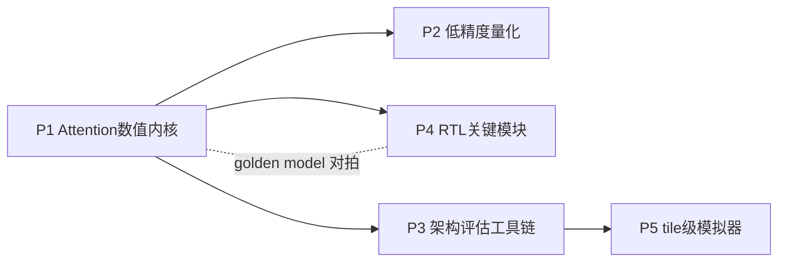

# 项目式学习方案（P1–P5）

> 配套 [research_plan.md](research_plan.md) 第八节「所需能力与补强清单」。
> 以 5 个渐进式动手小项目补齐进入阶段 1–3 所需的全部技能，每个项目的代码产出可直接复用到后续研究阶段。

## 总览

| 项目 | 主题 | 对应主线 | 周期 | 产出目录 |
|------|------|----------|------|----------|
| P1 | Attention 数值内核复现 | 主线1（算法侧） | 1–2 周 | `experiments/p1_attention_numerics/` |
| P2 | 低精度量化实验 | 主线2 | 2 周 | `experiments/p2_quantization/` |
| P3 | 架构评估工具链上手 | 阶段1 baseline | 2–3 周 | `sim/arch_eval/` |
| P4 | RTL 关键模块练手 | 主线1/3（硬件侧） | 3–4 周 | `rtl/` |
| P5 | 简易 tile-level 模拟器 | 主线4 | 2–3 周 | `sim/tile_sim/` |

### 依赖关系与推进顺序



- **P1 先行**（一切的数值参考基准）。
- **P2 与 P3 可并行**（一个偏算法、一个偏工具，互不阻塞）。
- **P4、P5 随后**（P4 依赖 P1 的 golden model，P5 依赖 P3 的仿真直觉）。
- 总周期约 **10–14 周**，与阶段 0 → 阶段 1 过渡期吻合。

---

## P1 — Attention 数值内核复现（1–2 周）

**目标**：亲手推导并实现 FlashAttention 前向的 online softmax 数据流，建立后续所有硬件设计的 golden model。

### 步骤

1. **标准 attention**：用 PyTorch 实现 `softmax(QK^T / sqrt(d)) V`，支持 causal mask，shape 约定 `(batch, heads, seq, head_dim)`。
2. **分块 attention（两遍法）**：将 K/V 沿序列维分块，先全局求 row-max/row-sum，再第二遍加权求和——理解"为什么需要两遍"。
3. **Online softmax（FlashAttention 前向）**：单遍扫描，维护 running max `m`、running sum `l`、累加器 `O`，每处理一个 KV 块就地 rescale。对照 FlashAttention 论文 Algorithm 1 逐行实现。
4. **数值对拍**：与 `torch.nn.functional.scaled_dot_product_attention` 比较，指标为 max abs error 与 cosine similarity；覆盖 fp32/fp16、多种 seq_len（128 – 8K）、causal 与非 causal。
5. **附加算子**：独立实现 RoPE（cos/sin 旋转）与 RMSNorm，并与 HuggingFace `transformers` 中 LLaMA 实现对拍；明确二者在完整 decoder layer datapath 中的位置。
6. **Decode 模式**：实现单 query token + KV cache 的 decode-step attention，体会 prefill 与 decode 的矩阵形状差异（`n×n` vs `1×n`）。

### 验收标准

- [ ] 三种实现（标准/分块/online）对拍误差 fp32 下 max abs error < 1e-5
- [ ] online softmax 支持任意块大小且结果与块大小无关
- [ ] RoPE、RMSNorm 与 transformers 参考实现一致
- [ ] decode-step attention 与 prefill 全量计算结果一致
- [ ] 写一页笔记：online softmax 的 rescale 推导（这是主线1硬件设计的核心公式）

### 阅读材料

- FlashAttention (Dao et al., NeurIPS 2022) — 重点 Algorithm 1 与 IO 复杂度分析
- FlashAttention-2 (Dao, 2023) — 工作划分与 rescale 次数优化
- Online normalizer calculation for softmax (Milakov & Gimelshein, 2018) — online softmax 原始出处
- RoFormer (Su et al., 2021) — RoPE 原理

---

## P2 — 低精度量化实验（2 周）

**目标**：掌握 INT4/FP8/MXFP4 量化的数值行为，复现旋转抑制 outlier 的效果，为主线 2 混合精度 datapath 打基础。

### 步骤

1. **fake-quant 工具库**：实现 quantize-dequantize 函数：
   - INT4/INT8：per-tensor、per-channel、per-group（group size 32/64/128），对称与非对称（zero-point）
   - FP8：E4M3 与 E5M2 两种格式（可用 `torch.float8_e4m3fn` 对拍）
   - MXFP4：block size 32 的共享指数缩放（对照 OCP Microscaling 规范）
2. **误差分析**：从真实模型（如 Qwen2.5-0.5B）导出若干层的 Q/K/V 激活，统计逐通道分布，定位 outlier 通道；对量化前后的 attention score 与 attention 输出计算相对误差。
3. **旋转抑制 outlier**：实现随机 Hadamard 变换与块对角旋转（BDR，对齐 SAW-INT4），验证旋转后激活分布更接近高斯、量化误差下降；理解"旋转在数学上是恒等变换、在数值上改变量化友好性"。
4. **KV cache 量化端到端**：在小模型上把 KV cache 量化为 INT4（token-wise per-group），跑 WikiText-2 困惑度，对比 fp16 baseline / 直接 INT4 / 旋转+INT4 三组。
5. **混合精度配置实验**：尝试"Q/K INT4 + V FP8 + softmax 累加 fp32"等组合，绘制精度-比特数权衡曲线。

### 验收标准

- [ ] fake-quant 库通过与 `torch.float8_*` 及手算样例的对拍测试
- [ ] 复现"旋转显著降低 INT4 量化误差"的现象（误差降低量化数据 + 分布直方图）
- [ ] 小模型 KV cache INT4 + 旋转的困惑度退化 < 直接 INT4
- [ ] 输出一份误差分析报告（脚本自动生成图表）

### 阅读材料

- SAW-INT4 (arXiv 2604.19157) — 块对角旋转 BDR，本课题主线2直接对标
- QuaRot (2024) — Hadamard 旋转量化的代表作
- BitDecoding (HPCA 2026) — 低比特 KV cache 的系统实现
- OCP Microscaling Formats (MX) Specification — MXFP4 格式定义

---

## P3 — 架构评估工具链上手（2–3 周，重点补短板）

**目标**：掌握 SCALE-Sim v3 与 Timeloop/Accelergy，亲手用仿真数据验证"decode 阶段 memory-bound"结论，产出可演化为阶段 1 短文的瓶颈分析。

### 环境说明（Windows）

Timeloop/Accelergy 与 SCALE-Sim 均建议在 **WSL2 (Ubuntu) + Docker** 下运行：

```bash
# WSL2 内
pip install scalesim            # SCALE-Sim
docker pull timeloopaccelergy/timeloop-accelergy-pytorch:latest  # Timeloop+Accelergy 官方镜像
```

### 步骤

1. **roofline 手推**：给定一组假想硬件参数（如 128 TOPS INT8、1 TB/s HBM、16 MB SRAM），计算 LLaMA-7B 规模单层 attention 在 seq=4K/32K/128K、prefill/decode 两种模式下的算术强度与理论 latency 上限，制成表格。
2. **SCALE-Sim v3**：
   - 配置一个 32x32 systolic array（weight/output stationary 各跑一遍）
   - 将 attention 拆成 GEMM 序列：`QK^T`、`PV`、QKV 投影、输出投影，写成 SCALE-Sim 的 GEMM topology csv
   - 对比 prefill（方阵）与 decode（`1×n` 瘦矩阵）的 cycle 数、PE 利用率、SRAM/DRAM traffic
3. **Timeloop + Accelergy**：
   - 跑通官方 exercises，学会 arch/workload/mapping/constraints 四类 YAML
   - 把步骤 2 的同一 workload 描述给 Timeloop，得到 energy/area 分解（MAC vs SRAM vs DRAM 占比）
4. **交叉校验**：SCALE-Sim 的 cycle 数、Timeloop 的 energy、roofline 的理论值三方互验，解释偏差来源。
5. **瓶颈分析短文**：整理成 3–5 页分析（图 + 表），回答：长上下文下片外访存占比多少？decode 利用率掉到多少？多大 SRAM 能容纳多长上下文的 KV tile？——这些数字直接支撑阶段 1。

### 验收标准

- [ ] SCALE-Sim 跑通 attention GEMM 序列，输出 cycle/utilization/traffic csv
- [ ] Timeloop 跑通同一 workload，输出 energy 分解
- [ ] 复现 decode PE 利用率显著低于 prefill 的现象，并有 roofline 解释
- [ ] 产出 `sim/arch_eval/analysis.md` 瓶颈分析短文

### 阅读材料

- SCALE-Sim v3 (arXiv 2504.15377) 与 GitHub 文档
- Timeloop (ISPASS 2019) + Accelergy (ICCAD 2019) + 官方 tutorial exercises
- Roofline model (Williams et al., CACM 2009)
- Efficient Processing of DNN (Sze et al.) 第 5–6 章 — dataflow 分类与 energy 模型

---

## P4 — RTL 关键模块练手（3–4 周）

**目标**：用 SystemVerilog 实现三个与主线 1/3 直接相关的关键模块，全部通过 Verilator 仿真并与 P1 的 PyTorch golden model 对拍。

### 环境说明

Verilator 建议在 WSL2 下安装（`apt install verilator`，或源码编译较新版本）。测试向量由 P1 的 Python 脚本生成为文本文件，testbench 读入比对。

### 步骤

1. **模块 A：exp 近似单元**（`rtl/exp_unit/`）
   - 先在 Python 中做算法设计：范围规约（`exp(x) = 2^(x·log2e)`，拆整数/小数部分）+ 分段线性或二次多项式近似，扫描定点位宽 vs 误差
   - SystemVerilog 实现流水线版本（2–3 级），输入定点、输出定点
   - 用 P1 生成的真实 attention score 分布做误差评估（而非均匀随机数）
2. **模块 B：online softmax 归约单元**（`rtl/softmax_unit/`）
   - 实现 running max 更新、`exp(x−m)` 调用模块 A、running sum 更新与 rescale 乘法路径
   - 处理一个 attention row 的分块流入，输出归一化前的部分和与最终 `m/l`
   - 这是主线 1「in-place online softmax」的电路雏形
3. **模块 C：小规模 systolic array**（`rtl/systolic_array/`）
   - 4x4 或 8x8 weight-stationary INT8 MAC 阵列，含输入 skew/deskew 逻辑
   - 跑通小 GEMM 与 golden model 对拍
   - 完成后带着问题读 FSA 论文：FlashAttention 的 rescale 如何嵌入阵列内部？写一页映射思考笔记
4. **对拍流程**：每个模块配 `tb/` 下的 testbench + Python 参考脚本，`make sim` 一键运行比对。

### 验收标准

- [ ] exp 单元在目标输入范围内相对误差 < 1e-3（或自定的误差预算），流水线时序正确
- [ ] softmax 单元处理任意分块顺序结果一致，与 P1 online softmax 逐拍对拍通过
- [ ] systolic array GEMM 结果与 numpy 参考完全一致
- [ ] 每个模块有波形截图/覆盖率简报 + 一页设计笔记

### 阅读材料

- FSA / SystolicAttention (arXiv 2507.11331) — 主线1架构基线，P4 的目标读物
- PLENA (arXiv 2509.09505) — flattened array 与 ISA 设计
- Softermax (DAC 2021)、I-BERT (ICML 2021) — softmax/exp 硬件近似的经典做法
- TPU v1 论文 (ISCA 2017) — weight-stationary systolic array 原型

---

## P5 — 简易 tile-level 模拟器（2–3 周）

**目标**：用 Python 写一个粗粒度性能模型，建模 tiling / double buffering / SRAM 约束对 attention latency 与 traffic 的影响，为主线 4 编译映射框架打地基。

### 步骤

1. **硬件抽象**：参数化描述——PE 阵列 (rows×cols×MACs/cycle)、SRAM 各 buffer 容量、DRAM 带宽、非 GEMM 单元吞吐。
2. **事件粒度**：以 tile 为单位建模三类事件：DMA load、compute、DMA store；compute 与 DMA 在 double buffering 下可重叠，SRAM 容量决定能否 double buffer。
3. **FlashAttention 数据流建模**：按 P1 的分块结构建模 `QK^T → online softmax → PV` 的 tile 依赖链，统计每种 tile 尺寸下的总 cycle 与 DRAM traffic。
4. **tile 搜索**：网格搜索合法 tile 配置（受 SRAM 容量约束），输出 latency 最优与 traffic 最优的 Pareto 点；观察 prefill/decode 最优 tile 的差异。
5. **交叉校验**：与 P3 的 SCALE-Sim 结果对比趋势（绝对值可有偏差，趋势须一致），写明模型的简化假设。

### 验收标准

- [ ] 模拟器可复现"tile 太小 → DMA 无法被 compute 掩盖；tile 太大 → 超 SRAM"的两端劣化
- [ ] tile 搜索输出 Pareto 前沿图（latency vs traffic）
- [ ] 与 SCALE-Sim 趋势一致性检查报告
- [ ] 代码模块化（hw config / workload / scheduler 分离），可扩展混合精度字节数建模

### 阅读材料

- FlashAttention 论文 IO 复杂度分析一节（tile 与 SRAM 的关系）
- Timeloop 论文的 mapspace 概念 — 你的 tile 搜索就是一个极简 mapper
- PLENA 的编译器/ISA 章节 — 主线4的长期方向

---

## 与研究阶段的衔接

| 学习项目 | 直接服务的研究阶段 | 复用方式 |
|----------|--------------------|----------|
| P1 | 阶段1/2 | golden model、RTL 测试向量来源 |
| P2 | 阶段3 | 量化库与误差分析流程直接沿用 |
| P3 | 阶段1 | 瓶颈分析短文即 workshop 文章素材 |
| P4 | 阶段2/4 | exp/softmax/阵列模块是原型的第一版组件 |
| P5 | 阶段5 | tile 搜索器演化为编译映射框架内核 |

## 学习节奏建议

- 每个项目结束时在 [progress/CHANGELOG.md](progress/CHANGELOG.md) 记一条进展，并勾掉 [progress/milestones.md](progress/milestones.md) 中对应验收项。
- 卡壳超过 2 天的问题记入 `docs/progress/logs/`，注明现象与假设——这些记录会成为论文 motivation 的素材。
- 阅读材料不必通读：P1–P2 精读算法与公式，P3 以跑通工具为先，P4 精读 FSA 的架构图与数据流章节。
