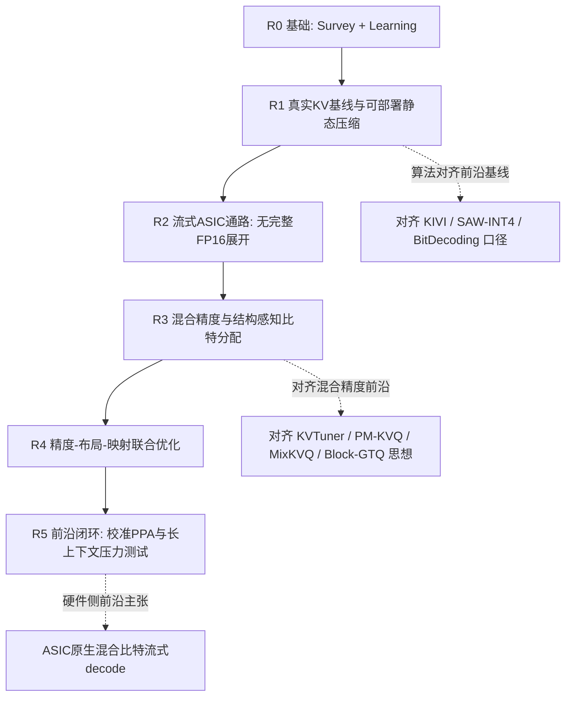

# 面向长上下文解码的精度感知 KV Cache 流式 Attention 架构与映射：长线研究计划

> 本计划为**长线、由浅及深**的学术研究路线，不按日历年切分任务。范围限定为单芯片/单加速器内 Transformer **推理**，以 **decode** 的低比特 / 混合精度 KV Cache 流式 Attention 为核心；prefill 仅作兼容与对照。最终验证深度：**架构模拟 + 关键数据通路 RTL/PPA**（FPGA / 完整 ISA 编译器 / 流片为可选延伸，非主线必需）。

## 〇、修订说明

相对上一版“四年按年排程”计划，本版调整为：

- **取消按年任务表**，改为深度递进的研究阶段（R0 → R5），以验收门槛而非时间驱动；
- **显式对齐 2025–2026 前沿**，把“追平再超越”写进路线，而不是停在固定 INT4 静态通路；
- **保留纵向主线**，拒绝回到“FlashAttention 阵列 + 全非 GEMM + 完整编译器”的横向铺开。

已有基础仍作为 R0：

| 资产 | 路径 | 作用 |
|------|------|------|
| 文献综述与缺口 | `survey/` | 论证碎片化与单芯片共设计空白 |
| 学习管线 P1–P5 | `learning/` | 数值、量化、瓶颈、玩具 RTL、tile 搜索技能与初步证据 |

---

## 一、前沿图景与研究定位（2024–2026）

### 1.1 算法与 GPU 系统侧：已到的前沿

近年工作把 KV Cache 压缩从“能否 INT4/2-bit”推进到**系统可部署**与**混合精度分配**：

| 方向 | 代表工作（非穷尽） | 前沿含义 |
|------|-------------------|----------|
| 非对称 / 低比特 KV | KIVI；BitDecoding（HPCA’26） | 真实 cache-path + fused dequant；布局必须匹配计算单元 |
| 服务约束下的轻量旋转 | SAW-INT4 | paged KV、规则访存下，复杂量化往往不敌 **token-wise INT4 + BDR** |
| 极限 2-bit + 自适应保留 | MiniKV；OScaR 等 | 量化与 eviction / 旋转联合，且需与 FlashAttention 类内核兼容 |
| 层/块混合精度 | KVTuner；PM-KVQ；KVmix | **精度本身成为配置变量**（离线搜索或渐进降比特） |
| 查询 / RoPE 感知分配 | MixKVQ；Block-GTQ 等 | 按 RoPE 块能量、query 相关性分配比特；**服务期不物化完整 FP16 KV** |
| Agent / 长 CoT 压力 | UltraQuant；PM-KVQ | 多轮与长推理链下误差累积成为一等公民问题 |

共识趋势：

1. **有效压缩是系统共设计问题**（布局、页表、融合内核、元数据），而非单纯 PTQ 表格；
2. **“不物化完整高精度 KV”** 成为高效实现的默认原则；
3. 固定均匀 INT4 已是强基线，前沿转向 **混合 / 渐进 / 结构感知的比特分配**。

### 1.2 专用硬件侧：仍明显滞后

| 方向 | 代表工作 | 与本课题的关系 |
|------|----------|----------------|
| FlashAttention-native 阵列 | SystolicAttention / FSA、StreamAttention、COSA+、DESA | 多假定较高内部精度，**系统化低比特 KV 证据不足** |
| 全栈单芯片 | PLENA | 扁平阵列 + 非对称量化 + native FA + ISA/编译器；最接近端到端，但并非以 **decode 混合精度 KV 流式通路 + 精度一等公民映射** 为差异化中心 |
| FPGA / 边缘 | AccLLM（W2A8KV4）、VitaLLM 等 | 证明共设计有效，平台与问题设定不同 |
| 稀疏 / PIM / chiplet | Salca、Titanus、AMMA 等 | 相邻上界；**不纳入本课题主实现路径** |

### 1.3 本课题要占据的前沿空位

在算法已进入混合精度、GPU 已进入布局感知 fused dequant 的背景下，**单芯片 ASIC 向**仍缺少可验证的一体化答案：

> 如何在固定带宽 / SRAM / 算力下，使 **混合（乃至结构感知）比特 KV** 以 **规则、可流水** 的布局进入硬件，经 **流式解量化** 直接驱动 decode Attention，并由 **精度—布局—映射联合优化** 在精度约束下逼近流量与能效前沿——且全程 **不依赖完整 FP16 KV 展开**？

差异化相对三类已有工作：

- 相对 **BitDecoding / SAW-INT4**：从 GPU kernel 迁移到 **ASIC datapath + PPA 可辩护代价模型**；
- 相对 **KVTuner / MixKVQ / Block-GTQ**：把混合比特从算法配置推进到 **硬件一等公民**（元数据、不规则位宽的规则化编码、控制与 DMA 开销计入能量）；
- 相对 **PLENA**：不做“更大全栈复刻”，而把刀锋放在 **decode × 混合精度 KV 流式通路 × 精度感知映射**。

---

## 二、核心科学问题

给定片外带宽 $B_{\mathrm{mem}}$、片上容量 $S_{\mathrm{SRAM}}$ 与计算预算，在可行配置集 $\mathcal{C}$ 上求解

$$
\min_{c\in\mathcal{C}}\; E_{\mathrm{token}}(c)
\quad\text{s.t.}\quad
\Delta\mathrm{Accuracy}(c)\le\epsilon,\;
L_{\mathrm{token}}(c)\le L_{\max},\;
S_{\mathrm{buf}}(c)\le S_{\mathrm{SRAM}}.
$$

配置 $c$ 至少包含：

- KV 表示：位宽、K/V 非对称、group / microscale、旋转或 RoPE 块策略；
- 布局：packed / paged、比特分组的规则化容器、scale 与载荷共址；
- 数据通路：fused dequant、$QK^\top$、online softmax（含 partial $O$）、$PV$、KV-split / head / batch 并行；
- 映射：tile、缓冲划分、DMA 深度，以及 **混合精度调度本身**。

优先优化 **energy/token** 与 **HBM bytes/token**，并报告 latency/token；所有结论分层：算法精度 / 架构模拟 / RTL–PPA。

---

## 三、由浅及深的技术路线（无年份约束）

原则：**下一深度以前一深度的验收为前提**；允许在某一深度纵向挖深后再前进，但不允许跳过 R1–R2 直接做“动态混合精度硬件故事”。

### R0｜已完成：问题地图与技能基线

- Survey：四主题碎片化、decode 带宽墙、单芯片共设计稀缺。
- Learning 相对证据：decode AI $\approx 50.9$ ops/byte（memory-bound）；传统 systolic decode 利用率可降至 $\sim 1\%$；16 MiB 约仅容 $\sim 2\mathrm{K}$ INT8 token 的层内 $K{+}V$；INT4+BDR 在 **proxy** 上可恢复部分 PPL。
- **限制（必须在后续关闭）**：proxy 量化、无完整 $PV$ 的 softmax RTL、tile 模拟器未建模压缩 KV / 元数据 / dequant。

### R1｜真实 Cache-Path 基线：追平“可部署静态压缩”前沿

**目标**：关闭 proxy，建立与当前算法/系统基线可对话的测量平台。

研究内容：

1. 真实 token-wise KV：quantize → pack → store → load → dequant → attention；
2. 对照谱：FP16；INT8；均匀 INT4；INT4+BDR（SAW-INT4 思想）；可选 KIVI 风格非对称 2/4-bit；
3. 布局：contiguous 与 **paged** 双报告；主声称不得只依赖理想连续地址；
4. 指标：任务精度 / PPL、HBM bytes/token、解量化与元数据开销分解；
5. 误差—通信模型：层 / 头 / token 位置敏感性；长上下文与多轮下的误差累积初探。

**对齐前沿的标准**：在约定模型与上下文上，静态 INT4(+BDR) 精度—流量 Pareto 达到可复现的 SOTA 邻域（以公开实现或论文表格为锚），并文档化与 proxy 的差距。

**进入 R2 的门槛**：

- 真实 cache-path 可复现；
- 至少一条长上下文设定下的 bytes/token–精度曲线；
- 锁定默认模型列表、硬件包络假设与评测协议。

### R2｜流式专用数据通路：追平“无完整 FP16 展开”的系统原则，并落到 ASIC

**目标**：把 BitDecoding / Block-GTQ 等系统原则硬件化——压缩 KV 经布局对齐后 **流式** 进入 MAC，默认路径 **不物化完整高精度 KV tile**。

研究内容：

1. Layout-aware 打包：载荷与 scale/zero-point（及旋转后布局）对齐 DMA / 页 / group 边界；
2. 流水：`fetch → (rotate) → fused dequant → QKᵀ → online softmax(m,ℓ,O) → PV`；
3. Decode 特化并行：head / batch / KV-split，缓解 $M=1$ 利用率崩溃；
4. 专用 decode simulator：显式建模元数据流量、dequant 周期、online softmax 与缓冲约束；与 Roofline / SCALE-Sim 做相对趋势交叉验证；
5. 关键 RTL：dequant 前端 + 完整 online softmax/$PV$ + 小型计算阵列；Verilator 匹配；首次综合得频率/面积/功耗初值。

**对齐前沿的标准**：在架构层证明“无完整 FP16 展开”相对“先解压再算”的流量与能量优势；功能正确性对齐 FlashAttention / FlashDecoding 数值口径。

**进入 R3 的门槛**：

- 默认执行路径不物化完整 FP16 KV tile；
- online softmax 含 partial $O$，误差界事先约定；
- 相对 FP16 KV，在 iso-accuracy 或明确退化点上展示 bytes/token 与模拟 energy/token 改善；
- 至少一个关键模块具备综合报告。

### R3｜混合精度与结构感知比特分配：进入当前算法前沿

**目标**：从均匀 INT4 推进到 **与 2025–2026 算法前沿同等级的表示能力**，并始终用硬件代价模型约束“算法好看但不可映射”的方案。

优先研究谱系（由易到难，可只深挖其中可规则化的子集）：

1. **层 / 块级混合精度**（KVTuner、PM-KVQ 类）：离线敏感性 → 静态或渐进比特表；
2. **时间维高精度窗口**：recent tokens / attention sink 保高精度，历史 token 降比特（KVmix 类思想）；
3. **结构感知分配**：RoPE 块能量、query 相关 key channel（Block-GTQ / MixKVQ 类）——**仅采纳可规则化、可打包的分配结果**；
4. 明确拒绝作为主线的：高度不规则稀疏索引、强依赖随机 eviction 且无法与规则 DMA 共存的策略（可作对照或 Future Work）。

硬件要点：

- **多速率比特的规则化容器**（如按组对齐到 nibble/byte 通道），避免 PE 侧任意位宽乱序；
- 元数据、重打包、控制流全部计入 traffic / energy；
- 与 R2 通路兼容：混合精度是通路上的模式，而非另起炉灶。

**对齐前沿的标准**：在相同平均比特预算下，精度不低于或接近公开混合精度方法的报告邻域；同时给出 **ASIC 代价下的 Pareto**（这是 GPU 论文通常缺失的一维）。

**进入 R4 的门槛**：

- 至少一种混合 / 结构感知策略在真实 cache-path 上稳定优于均匀 INT4（同预算或同精度下更省流量）；
- 硬件开销模型与算法增益同时报告；若增益被元数据吃掉，则收缩策略粒度，不硬宣称“动态一定更好”。

### R4｜精度—布局—映射联合优化：形成硬件侧独特贡献

**目标**：使精度配置成为映射器的一等决策变量，完成“算法前沿 × 架构约束”的闭环。

研究内容：

1. 联合搜索空间：`{bit plan, group/RoPE-block container, tile, head/batch/KV-split, SRAM 划分, DMA 深度}`；
2. 目标与约束同 §二；输出可解释策略或启发式（**非**通用深度学习编译器 / 完整自定义 ISA 栈）；
3. 服务态因素：上下文长度变化、paged 碎片、可选小 batch；
4. Prefill 仅附录对照；主叙事保持 decode。

**对齐前沿的标准**：相对手工静态 INT4 与相对“仅算法混合精度、忽略硬件开销”的虚高数字，均能展示可重复、可解释的收益。

**进入 R5 的门槛**：联合优化在约定负载上稳定可复现；开销入账；失败则收缩为 R2+R3 的有限层间表 + 手工映射并进入结题准备。

### R5｜前沿闭环：长压力测试、跨层校准与主张固化

**目标**：把主张推到可发表的硬件证据强度，并在最苛刻工作负载上考验。

研究内容：

1. 用 RTL 综合结果校准模拟器中 dequant / softmax / MAC / SRAM 代价；
2. 长上下文（32K–128K）、长 CoT / 多轮 agent 类压力（对齐 UltraQuant、PM-KVQ 问题设定的可复现子集）；
3. 与 GPU 系统基线（FlashDecoding、BitDecoding 类）做 **同模型同上下文的相对比较**（平台不同，报告口径透明）；
4. 与 PLENA 等 ASIC 叙事对齐比较维度：利用率、bytes/token、energy/token、精度，而非无条件倍数；
5. 固化三句贡献：**代价模型与测量、混合比特流式 decode 通路、精度感知联合映射**；未关闭风险写入 Limitation。

**可选延伸（非主线）**：FPGA 原型；更大规模阵列；公开 PDK 之外的先进工艺库；极保守的 ISA 子集仅服务本通路配置下发。

---

## 四、评估矩阵

### 4.1 工作负载

- 模型：0.5B–8B 开源 decoder 为主；更大模型用离线 KV trace / 分层抽样；
- 上下文：≥4K / 32K，条件允许 128K；**decode 主结果，prefill 附录**；
- Batch：默认 1，可选小 batch；
- 布局：contiguous + paged；
- 数值对照：FP16；INT8；均匀 INT4±BDR；混合精度方案；可选 2-bit / MXFP4 作为扩展对照。

### 4.2 指标分层

| 层 | 指标 |
|----|------|
| 算法 | 精度 / PPL / 长上下文或推理任务；与 FP 参考误差 |
| 架构 | bytes/token、latency/token、带宽与 PE 利用率、SRAM、energy/token（模型） |
| RTL | 功能匹配、频率、面积、功耗、关键通路延迟 |

禁止跨层偷换单位（如把分析模型 joule 写成硅片实测）。

### 4.3 工具

- 算法：PyTorch、Hugging Face、Triton / FlashAttention 参考、公开 KV 量化实现、lm-eval 子集；
- 架构：自研 decode simulator（主）、SCALE-Sim、Timeloop/Accelergy、Roofline、按需 DRAM 模型；
- RTL：SystemVerilog、Verilator、黄金模型；综合用实验室工具链或 Yosys/OpenROAD + 可用库。

---

## 五、设施（能力导向，非排期）

**最低**：≥128 GB 内存工作站、≥24 GB GPU、大容量 NVMe、Linux、可用综合路径。  
**理想**：更大显存 GPU、256 GB+ 内存、商业综合与功耗签核 + 正规工艺库。  
**非必需**：高端 HBM FPGA、完整 MLIR 编译器、集群、流片。

---

## 六、风险、收缩与停止规则

| 风险 | 收缩 |
|------|------|
| 低比特 / 混合精度在长 CoT 崩塌 | 提高敏感层与 recent token 精度；退回 INT8+布局优化 |
| 解量化与元数据吃掉收益 | 强化融合与规则化容器；改叙事为利用率 / 映射贡献 |
| 结构感知分配无法规则化 | 仅保留层间表 + 时间窗；复杂 RoPE/query 方案降为算法附录 |
| 与 BitDecoding/PLENA 叙事撞车 | 固定对比表：平台、是否混合比特硬件原生、是否计入元数据、是否 RTL |
| 模拟器与 RTL 趋势矛盾 | 冻结功能优先校准；未校准不宣称绝对 energy |
| 范围再次膨胀 | 稀疏主线、MoE、PIM、完整编译器一律 Future Work |

---

## 七、预期成果形态（论文链，不绑会议）

1. **测量与模型**：真实低比特 KV 的误差—元数据—traffic；decode 瓶颈再定位（关闭 proxy）。
2. **架构**：规则布局下的流式 fused-dequant decode Attention（无完整 FP16 展开）+ 关键 RTL。
3. **前沿系统**：混合 / 结构感知比特 × 精度感知映射，在 ASIC 代价模型下相对均匀 INT4 与 GPU 口径的 Pareto；学位论文整合。

成功标准不是“功能最全”，而是在 **decode × 压缩 KV × 硬件原生混合精度映射** 这一刀锋上，达到并局部超越 2025–2026 公开前沿的可验证主张。

---

## 八、执行约定

1. 本文件为仓库**现行唯一研究计划**；按年排程的旧表述作废。
2. `survey/`、`learning/` 归档为 R0；后续实验按 R1–R5 深度组织目录（实施时另建）。
3. 每完成一个深度，追加简短“验收状态”记录：通过 / 收缩后通过 / 未通过原因。
4. 定量阈值与模型列表在 R1 协议锁定后写入修订记录，避免无基线倍数承诺。
