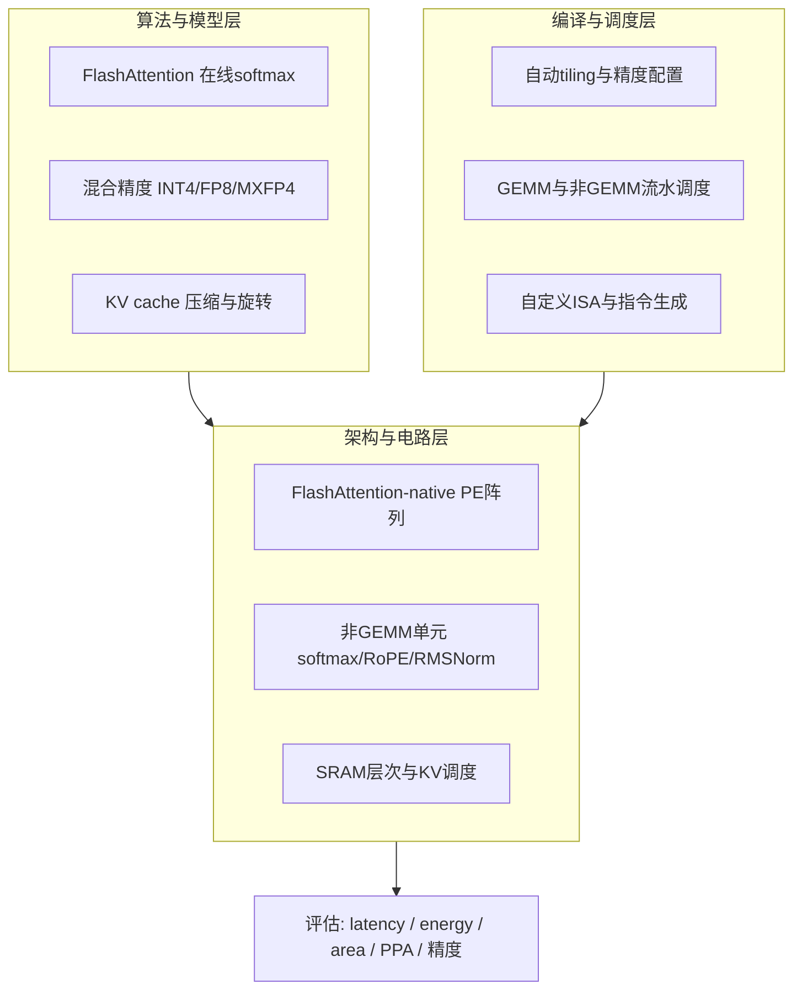

# 面向大语言模型推理的高能效 Attention 加速器及软硬件协同优化研究计划

> 本计划为学术研究计划。范围限定为单芯片/单加速器内的 Transformer **推理** 加速，聚焦 attention 子系统，不涉及大规模分布式训练与多芯片 chiplet 系统。

## 一、研究背景与问题陈述

大语言模型推理已从"计算受限"转向"访存受限"。核心矛盾集中在 attention 子系统：

- 长上下文下 attention 复杂度 $O(n^2 d)$，且 KV cache 随 token 线性增长，decode 阶段呈强 memory-bound（BitDecoding HPCA'26、SAW-INT4 均印证此趋势）。
- FlashAttention 的分块 + online softmax 数据流难以原生映射到传统 systolic array（FSA/SystolicAttention 2025、PLENA 2025 是早期硬件尝试）。
- softmax / RMSNorm / RoPE 等非 GEMM 算子频繁打断主流水，造成 PE 利用率下降。
- 低精度（INT4/FP8/MXFP4）能显著降低带宽与功耗，但 attention score、softmax 累加存在数值稳定性风险。

**核心科学问题**：在给定片上 SRAM 与 PE 阵列资源约束下，如何设计一种原生支持 FlashAttention 数据流、采用混合精度计算、并融合非 GEMM 算子的 attention 加速架构，并通过编译映射方法，最小化长上下文推理的片外访存、提升能效（tokens/s/W）且保持近无损精度？

## 二、研究目标

- **总目标**：构建一个 FlashAttention-native + mixed-precision + non-GEMM-aware + compiler-supported 的高能效 attention 加速器原型，并完成架构级与 RTL 级评估。
- **可量化目标（示例，待 baseline 后校准）**：相对 GPU FlashAttention/FlashDecoding 基线，在 32K–128K 上下文下显著降低 energy/token，提升 PE 利用率，精度损失控制在可接受范围内。

## 三、研究框架与四条主线

- **主线1 FlashAttention 原生数据流**：分块 Q/K/V、in-place online softmax（row-max/row-sum reduction 路径）、attention score 不落片外、prefill/decode 双模式调度。
- **主线2 混合精度 attention datapath**：Q/K/V 与 KV cache 低比特（INT4/FP8/MXFP4），softmax/输出累加高精度；scale/zero-point/反量化融合；引入 Hadamard/块对角旋转抑制 outlier（参考 SAW-INT4 的 BDR）。
- **主线3 非 GEMM 专用硬件**：online softmax 单元（exp/reciprocal 分段线性或多项式近似）、RMSNorm（reduction + rsqrt 近似）、RoPE（cos/sin 查表 + 旋转融合），与主阵列协同调度避免阻塞。
- **主线4 编译与硬件协同**：tile 搜索、buffer 分配、DMA 与计算重叠、混合精度配置下发、prefill/decode 自适应，生成自定义 ISA 指令流。

## 四、研究阶段与里程碑

| 阶段 | 内容 | 产出 |
|------|------|------|
| 阶段0 | 文献与基线调研 | survey + 选题报告（`docs/00_background_and_baselines.md`, `docs/metrics.md`） |
| 阶段1 | Baseline 建模与瓶颈定位 | 瓶颈分析 + 第一篇 workshop/会议短文 |
| 阶段2 | FlashAttention-native 架构 | 架构论文（目标 DAC/ASP-DAC/ISCAS 或会议） |
| 阶段3 | 混合精度 datapath | 核心论文（目标 HPCA/DAC/TCAS-I/TVLSI） |
| 阶段4 | 非 GEMM 单元与协同调度 | 模块级论文或并入主架构论文 |
| 阶段5 | 编译映射框架 | 软硬件协同论文（目标 MICRO/ISCA/DATE） |
| 阶段6 | 系统集成与博士论文 | 完整 PPA 与精度评估 + 学位论文 |

## 五、研究方法与评估工具链

- **算法验证**：PyTorch 复现 attention/量化方案，在 LLaMA-3/Qwen3 类模型与 GSM8K/GPQA/MATH500 等基准上评估精度（对齐 SAW-INT4 的评测口径）。
- **架构级评估**：Timeloop + Accelergy（energy/area）、SCALE-Sim v3（cycle-accurate + Ramulator 访存）、TransInferSim（Transformer 推理 cycle-accurate）。
- **RTL 级评估**：SystemVerilog 实现关键模块，Verilator/iverilog 仿真，Synopsys DC/Cadence Genus 综合，给出频率/面积/功耗与 timing 收敛。
- **指标体系**：latency、throughput、tokens/s/W、TOPS/W、PE utilization、SRAM/HBM traffic、energy per token、精度损失。

## 六、预期创新点

- **架构创新**：FlashAttention-native 的 in-place online softmax 阵列结构，消除 score 片外往返与外部 vector 单元依赖。
- **数值/电路创新**：面向 attention 的混合精度 datapath + 旋转/反量化片上融合 + 低成本 exp/rsqrt 近似，兼顾能效与数值稳定性。
- **软硬件协同创新**：面向该架构的自动 tiling/精度/调度框架与自定义 ISA，prefill/decode 自适应映射。

## 七、风险与应对

- **低精度精度损失**：引入块对角 Hadamard 旋转、per-group scaling、敏感张量保高精度；以精度-能效 Pareto 前沿呈现。
- **非 GEMM 近似误差累积**：误差建模 + 与高精度参考逐算子对比，控制端到端偏差。
- **课题过大**：严格界定为单加速器 attention 推理，MoE/CIM/chiplet 仅作展望，不纳入主线。
- **评估可信度**：架构级与 RTL 级交叉验证，关键设计点用综合数据校准模型。

## 八、所需能力与补强清单

- **模型**：attention、FlashAttention、online softmax、RoPE、RMSNorm、KV cache、INT4/FP8/MXFP4 量化与旋转。
- **架构**：systolic array、SRAM 层次、DMA、double buffering、reduction network、low-bit MAC、flattened array（PLENA 风格）。
- **数字 IC**：SystemVerilog、pipeline、定/浮点 datapath、exp/rsqrt 近似电路、综合与 PPA/timing 分析。
- **工具**：PyTorch、C++/Python simulator、Timeloop/Accelergy、SCALE-Sim v3、TransInferSim、Verilator、Synopsys DC。

## 九、执行说明

本仓库当前仅保存研究计划与阶段 0 配套文档。后续将按第四节「研究阶段与里程碑」依次推进各阶段实现与实验。
