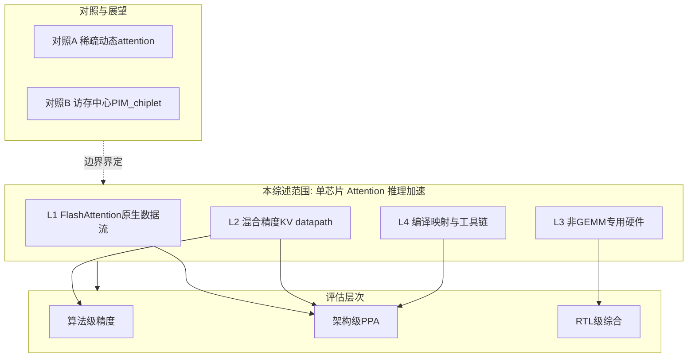

# 综述研究计划：高能效 Attention 加速器及软硬件协同优化

> 阶段 0 文献综述写作指南。配套文献库见 [references.bib](manuscript/references.bib)、[paper_matrix.md](paper_matrix.md)、[papers/](papers/)。英文 LaTeX 综述稿见 [manuscript/](manuscript/)。

## 0. 背景与定位

现有仓库已有研究计划与阶段 0 骨架文档（[research_plan.md](../research_plan.md)、[00_background_and_baselines.md](../00_background_and_baselines.md)、[metrics.md](../metrics.md)）。本计划把阶段 0 的「文献与基线调研」扩展为一份**完整、可发布质量的中文综述**，并产出配套的论文清单（bib）与对标矩阵，作为后续选题报告与各阶段论文 related-work 的复用基础。

综述写作严格沿用研究计划的范围界定：**单芯片/单加速器内的 Transformer 推理（prefill+decode）**，PIM/CIM、多 chiplet、训练加速、稀疏 MoE 调度仅作「相关方向与展望」一节简述，不作为主线深入。

## 1. 综述范围与分类法（Taxonomy）

以研究计划四条主线为一级分类，并补充两类「边界/对照」方向：

- **主线1 FlashAttention 原生数据流与阵列架构**：online softmax 映射、row-max/row-sum 就地归约、prefill/decode 双模式。代表：FSA/SystolicAttention (arXiv 2507.11331)、PLENA (arXiv 2509.09505)、FlatAttention (arXiv 2604.02110)、FlashAttention/FlashDecoding 基线。
- **主线2 混合精度 attention datapath 与 KV cache 量化**：INT4/FP8/MXFP4、旋转抑制 outlier、per-group/token-wise scaling、反量化片上融合。代表：SAW-INT4/BDR (arXiv 2604.19157)、BitDecoding (HPCA'26)、BATQuant (MXFP4, arXiv 2603.16590)、KIVI、QuaRot/SpinQuant、UltraQuant。
- **主线3 非 GEMM 专用硬件**：exp/softmax 分段线性或多项式近似、RMSNorm reduction+rsqrt、RoPE cos/sin 查表与旋转融合、与主阵列协同调度。
- **主线4 编译/映射与软硬件协同**：自动 tiling、buffer 分配、DMA-计算重叠、混合精度配置下发、自定义 ISA；评估工具链 Timeloop/Accelergy、SCALE-Sim v3、TransInferSim。
- **对照A 稀疏/动态 attention 加速器**：Salca (arXiv 2604.24820)、top-k/动态稀疏。
- **对照B 访存中心架构（仅展望）**：AMMA (arXiv 2604.26103)、LoL-PIM (arXiv 2412.20166) —— 用于界定「本课题不做 PIM/chiplet」的边界。

每条主线统一用一组维度刻画，便于横向对比（以列表而非表格在正文展开）：

- 问题切入点
- 数据流/精度方案
- 硬件结构
- 评估层次（算法/架构/RTL）
- 报告指标
- 开源情况
- 与本课题关系（基线/方法借鉴/差异化）

## 2. 文献检索与筛选方法

- **检索源**：arXiv (cs.AR/cs.LG)、DBLP、Google Scholar、Semantic Scholar；顶会 ISCA/MICRO/HPCA/ASPLOS/DAC/DATE/ISSCC/TCAS-I/TVLSI 近 3 年。
- **检索词组合**：FlashAttention accelerator、systolic array attention、KV cache quantization INT4/MXFP4、softmax hardware approximation、LLM inference accelerator co-design、long-context decode memory-bound 等。
- **筛选准则**：纳入近 3 年（2023–2026）与四条主线强相关、含硬件或算法-硬件协同贡献的工作；经典奠基工作（Attention/Transformer、FlashAttention v1/v2/v3、QuaRot 等）作为背景引用。
- **滚雪球**：以 FSA、PLENA、SAW-INT4、BitDecoding 的引用/被引网络做前后向扩展。
- **质量记录**：每篇登记 出处/年份/核心贡献/报告指标/是否开源/与主线映射，统一存入 bib + 速记表。

## 3. 综述文档结构（待撰写）

在 `docs/survey/` 下组织（全中文、mermaid 图、列表为主）：

| 文件 | 内容 | 状态 |
|------|------|------|
| [survey_plan.md](survey_plan.md) | 本文件：综述写作计划 | 已完成 |
| [manuscript/references.bib](manuscript/references.bib) | BibTeX 文献库 | 已完成 |
| [manuscript/attention_accelerator_survey.tex](manuscript/attention_accelerator_survey.tex) | 英文 IEEE 综述 LaTeX 稿 | 进行中 |
| [paper_matrix.md](paper_matrix.md) | 文献对标矩阵 | 已完成 |
| [papers/](papers/) | 文献 PDF 库 | 已完成 |
| `00_overview.md` | 综述动机、范围、分类法总览、与 research_plan 对应 | **待撰写** |
| `01_flashattention_dataflow.md` | 主线1 综述 | **待撰写** |
| `02_mixed_precision_kv.md` | 主线2 综述 | **待撰写** |
| `03_non_gemm_units.md` | 主线3 综述 | **待撰写** |
| `04_compiler_codesign.md` | 主线4 综述 + 评估工具链 | **待撰写** |
| `05_adjacent_and_outlook.md` | 对照方向与展望 | **待撰写** |
| `06_gaps_and_positioning.md` | Gap 分析与差异化定位 | **待撰写** |

## 4. 综述核心论证主线（贯穿全文的故事线）

1. **瓶颈转移**：LLM 推理从 compute-bound 转向 memory-bound，attention + KV cache 是长上下文与 decode 的核心瓶颈。
2. **分线缓解**：四条主线分别针对数据流映射、低精度 datapath、非 GEMM 算子、编译调度提出方案。
3. **覆盖不足**：多数工作只覆盖其中 1–2 点——GPU kernel 优化、单阵列 FlashAttention、KV 量化、或纯非 GEMM 算子加速器各自为政。
4. **研究机会**：在单加速器内统一「FlashAttention-native 阵列 + 混合精度 datapath + 非 GEMM 融合 + 编译映射」，并做 PPA × 精度联合评估，仍是开放问题。

## 5. 各章写作要点（提纲）

### 5.1 `00_overview.md`
- 综述动机与问题陈述
- 范围界定（纳入/不纳入）
- 分类法总览（taxonomy 图）
- 统一对比维度说明
- 与 [research_plan.md](../research_plan.md) 的对应关系

### 5.2 `01_flashattention_dataflow.md`（主线1）
- FlashAttention v1–v3 / FlashDecoding 算法基线
- Online softmax 的硬件友好形式（row-max/row-sum reduction、exp 输入 ≤0）
- 硬件映射分类：GPU kernel / 双阵列+softmax / 单阵列原生 / flattened array / tile collective
- 重点对比：FSA、PLENA、FlatAttention、COSA、StreamAttention
- Prefill vs decode 双模式差异
- 开放问题与本课题切入点

### 5.3 `02_mixed_precision_kv.md`（主线2）
- 精度格式概览（FP16/FP8/INT4/MXFP4）
- 量化方法分类：SmoothQuant、QuaRot/SpinQuant、BDR/SAW-INT4、KIVI、BATQuant、UltraQuant
- 硬件映射：低比特 MAC、旋转/反量化融合、scale 管理
- 精度-能效 Pareto 分析框架（对齐 [metrics.md](../metrics.md) 实验矩阵）
- BitDecoding 作为 GPU 侧混合精度 KV 基线

### 5.4 `03_non_gemm_units.md`（主线3）
- Softmax/exp 近似：LUT、分段线性、base-2 softmax（Softermax）、FSA 阵列内 exp
- RMSNorm/rsqrt 近似：LOD-LUT-MUL、Newton 法
- RoPE：cos/sin 查表 + 旋转融合（文献较少，标注为空白）
- 统一 datapath 趋势：MIVE、SOLE
- 与主阵列协同调度、pipeline 不阻塞

### 5.5 `04_compiler_codesign.md`（主线4）
- Tiling 与 buffer 分配
- DMA-计算重叠、prefill/decode 自适应映射
- 自定义 ISA 与指令生成（PLENA 编译栈对标）
- 评估工具链：Timeloop+Accelergy、SCALE-Sim v3、TransInferSim
- 三层评估校准（算法/架构/RTL，见 metrics.md）

### 5.6 `05_adjacent_and_outlook.md`（对照）
- 稀疏/动态 attention：Salca、Sanger、SpAtten
- 访存中心架构：AMMA、LoL-PIM、NeuPIM
- 明确边界：本课题不做 chiplet/PIM/MoE 主线

### 5.7 `06_gaps_and_positioning.md`
- 横向对比后的 research gap
- 映射到 research_plan 的三条预期创新点
- 开放问题清单（数值稳定性、非 GEMM 误差累积、双模式调度）
- 可量化机会点（待 baseline 后校准）

## 6. 里程碑

| 阶段 | 内容 | 产出 | 状态 |
|------|------|------|------|
| M1 | 检索与入库 | references.bib + paper_matrix + PDF 库 | **已完成** |
| M2 | 四条主线分章 | 01–04 初稿 | 待完成 |
| M3 | 对照与定位 | 05 + 06，故事线闭环 | 待完成 |
| M4 | 交叉校对 | 指标口径、引用准确性、README 更新 | 待完成 |

## 7. 交付物与质量门槛

- 一份分章中文综述（`docs/survey/` 共 7–8 个 markdown 文件）+ BibTeX 库 + 对标矩阵。
- 质量门槛：
  - 每条主线有明确 taxonomy、≥6 篇代表作、统一维度对比
  - Gap 分析能直接映射到 research_plan 的预期创新点
  - 所有引用可溯源（含 arXiv 编号/会议出处）
  - 指标口径与 [metrics.md](../metrics.md) 对齐

## 8. 注意事项

- 本阶段为文献综述，不涉及代码实现与仿真；仅编辑 `docs/` 下 markdown 与 bib 文件。
- 写作时优先引用 [paper_matrix.md](paper_matrix.md) 中已登记文献，PDF 见 [papers/](papers/)。
- 分章撰写、逐章提交，便于版本管理与审阅。
