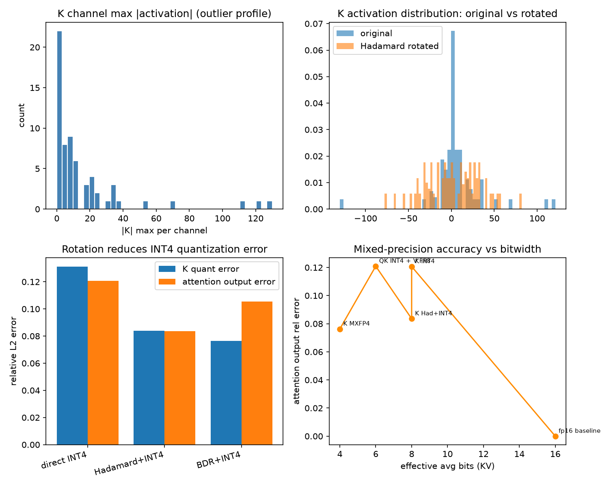

# P2 量化误差分析报告

- Model: `Qwen/Qwen2.5-0.5B-Instruct`
- Head dim: 64
- Outlier setup: 使用真实模型激活中的自然 outlier，未做人工放大

## K 量化相对误差

| 方法 | 相对 L2 误差 |
|------|-------------|
| 直接 INT4 per-group | 0.1312 |
| Hadamard + INT4 | 0.0838 |
| BDR + INT4 | 0.0763 |

## Attention 输出相对误差

| 方法 | 相对 L2 误差 |
|------|-------------|
| 直接 INT4 K | 0.1207 |
| Hadamard + INT4 K | 0.0836 |
| BDR + INT4 K | 0.1053 |

## 混合精度权衡

| 配置 | 平均比特 | 输出误差 |
|------|---------|---------|
| fp16 baseline | 16 | 0.0000 |
| K INT4 | 8 | 0.1207 |
| K Had+INT4 | 8 | 0.0836 |
| QK INT4 + V FP8 | 6 | 0.1209 |
| K MXFP4 | 4 | 0.0763 |

## 结论

- Hadamard 旋转使 K 的 INT4 量化误差降低约 **36.1%**，激活分布更接近高斯，outlier 被分散到各通道。
- Block-Hadamard BDR（`block_diag(H) @ D`）使 K 的 INT4 量化误差降低约 **41.8%**。
- 旋转后 attention 输出误差低于直接 INT4，验证了旋转在数值上改善量化友好性。