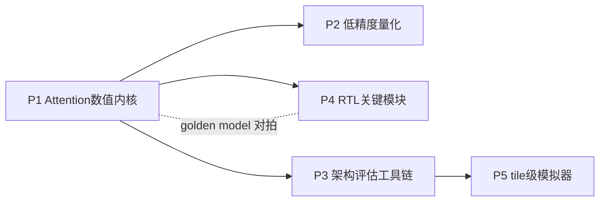

# 项目式学习方案（P1–P5）

> 配套 [docs/research_plan.md](../docs/research_plan.md) 第八节「所需能力与补强清单」。  
> 以 5 个渐进式动手小项目补齐进入阶段 1–3 所需的全部技能；每个项目目录自包含 **计划、代码、验收报告**。

## 总览

| 项目 | 主题 | 对应主线 | 周期 | 目录 |
| --- | --- | --- | --- | --- |
| P1 | Attention 数值内核复现 | 主线1（算法侧） | 1–2 周 | [p1_attention_numerics/](p1_attention_numerics/) |
| P2 | 低精度量化实验 | 主线2 | 2 周 | [p2_quantization/](p2_quantization/) |
| P3 | 架构评估工具链上手 | 阶段1 baseline | 2–3 周 | [p3_arch_eval/](p3_arch_eval/) |
| P4 | RTL 关键模块练手 | 主线1/3（硬件侧） | 3–4 周 | [p4_rtl/](p4_rtl/) |
| P5 | 简易 tile-level 模拟器 | 主线4 | 2–3 周 | [p5_tile_sim/](p5_tile_sim/) |

**Synthesis paper (English, IEEE conference style):** [manuscript/](manuscript/) — P1–P5 end-to-end write-up with verified citations and staged experiment figures.

每个子目录含：

- `PLAN.md` — 步骤、验收标准、阅读材料
- `REPORT.md` — 验收报告
- 代码与笔记（`README.md`、`reading_notes.md` 等）

## 依赖关系与推进顺序

- **P1 先行**（一切的数值参考基准）。
- **P2 与 P3 可并行**（一个偏算法、一个偏工具，互不阻塞）。
- **P4、P5 随后**（P4 依赖 P1 的 golden model，P5 依赖 P3 的仿真直觉）。
- 总周期约 **10–14 周**，与阶段 0 → 阶段 1 过渡期吻合。

## 与研究阶段的衔接

| 学习项目 | 直接服务的研究阶段 | 复用方式 |
| ---- | --------- | ------------------------- |
| P1 | 阶段1/2 | golden model、RTL 测试向量来源 |
| P2 | 阶段3 | 量化库与误差分析流程直接沿用 |
| P3 | 阶段1 | 瓶颈分析短文即 workshop 文章素材 |
| P4 | 阶段2/4 | exp/softmax/阵列模块是原型的第一版组件 |
| P5 | 阶段5 | tile 搜索器演化为编译映射框架内核 |

## 学习节奏建议

- 每个项目结束时在 [docs/progress/CHANGELOG.md](../docs/progress/CHANGELOG.md) 记一条进展，并勾掉 [docs/progress/milestones.md](../docs/progress/milestones.md) 中对应验收项。
- 卡壳超过 2 天的问题记入 [docs/progress/logs/](../docs/progress/logs/)，注明现象与假设——这些记录会成为论文 motivation 的素材。
- 阅读材料不必通读：P1–P2 精读算法与公式，P3 以跑通工具为先，P4 精读 FSA 的架构图与数据流章节。
