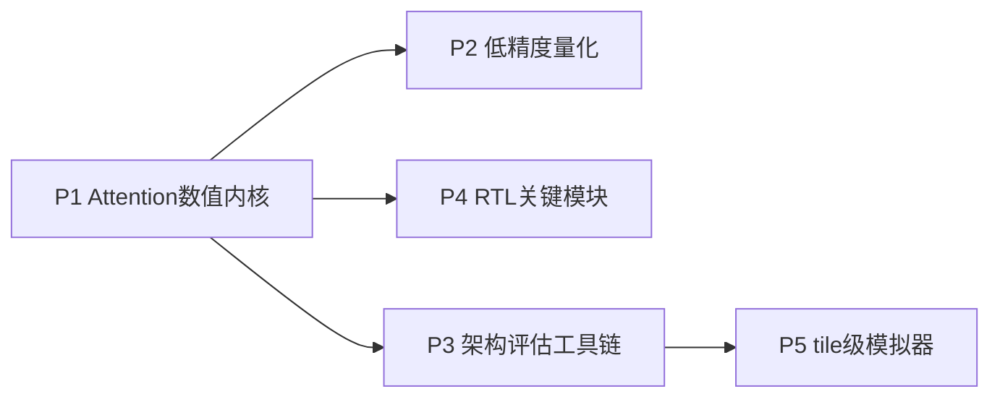

# 项目式学习方案（P1–P5）— 已归档

> **状态：R0 技能建设，已全部完成。**  
> 本目录**不再定义课题主线**。现行研究计划见 [`docs/research_plan.md`](../docs/research_plan.md)（R0–R5）。  
> 正式研究从 [`research/`](../research/) 的 R1 起。  
> 下文「主线1–4 / 阶段1–5」表述为历史映射，仅便于阅读旧 PLAN/REPORT。

配套能力清单见研究计划「所需能力」；每个项目目录自含 **计划、代码、验收报告**。

## 总览

| 项目 | 主题 | 历史映射（已废止为主线定义） | 状态 | 目录 |
| --- | --- | --- | --- | --- |
| P1 | Attention 数值内核复现 | 原「主线1」算法侧 | 已完成 | [p1_attention_numerics/](p1_attention_numerics/) |
| P2 | 低精度量化实验（**proxy KV**） | 原「主线2」 | 已完成 | [p2_quantization/](p2_quantization/) |
| P3 | 架构评估工具链 | 原阶段1 baseline | 已完成 | [p3_arch_eval/](p3_arch_eval/) |
| P4 | RTL 关键模块（缺完整 $PV$） | 原「主线1/3」 | 已完成 | [p4_rtl/](p4_rtl/) |
| P5 | tile-level 模拟器（未建模压缩 KV） | 原「主线4」 | 已完成 | [p5_tile_sim/](p5_tile_sim/) |

**Synthesis paper:** [manuscript/](manuscript/) — 英文综合稿；属学习归档，非学位论文大纲。

## 已知局限（须在 R1+ 关闭）

- P2：projection-output proxy，非真实 token-wise KV Cache。  
- P4：online softmax 缺 partial $O$/$PV$；无综合 PPA。  
- P5：未建模 compressed KV、scale 元数据与 dequant 周期。

## 与现行计划的衔接

| 学习资产 | 服务的现行深度 |
| ---- | --------- |
| P1 数值 golden | R1–R2 正确性 |
| P2 量化与旋转经验 | R1 真实 cache-path / R3 混合精度（须重做路径） |
| P3 瓶颈证据 | R0 证据；R1 模拟器对照 |
| P4 RTL 积木 | R2 关键通路扩展 |
| P5 tile 搜索 | R2–R4 映射雏形（须加压缩 KV 模型） |

## 依赖关系（历史）

