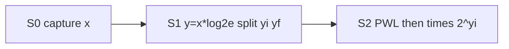

# exp_unit 设计笔记（模块 A）

> 实现笔记。扫参与误差预算见 [exp_approx_sweep.md](exp_approx_sweep.md)；算法背景见 [../reading_notes.md](../reading_notes.md) Softermax / FSA / I-BERT 节。

## 接口

| 信号 | 方向 | 格式 | 说明 |
|------|------|------|------|
| `clk`, `rst_n` | in | — | 异步低有效复位 |
| `valid_in` | in | — | 输入握手（每拍可连续有效） |
| `x` | in | Q6.10 signed 16b | $x = S - m \le 0$ |
| `valid_out` | out | — | 与 `y` 对齐，固定延迟 3 拍 |
| `y` | out | UQ0.24 unsigned 24b | $\approx\exp(x)\in(0,1]$；$1.0$ 饱和为 `0xFFFFFF` |

## 流水线（3 级）

1. **S0**：锁存 `x` / `valid`。
2. **S1**：`y = x * log2(e)`（Q6.10 × Q2.14 → Q8.24）；`yi = floor(y)`（算术右移 24）；`yf = y - yi·2^{24}`（UQ0.24）。
3. **S2**：16 段 PWL 逼近 $2^{y_f}$（intercept UQ2.22 + slope UQ2.14 × 段内偏移）；再按 `yi` 算术移位得到 UQ0.24，就近舍入并饱和。

常量：`LOG2E_Q214 = 23637`。斜率/截距 ROM 与 `scripts/exp_rtl_model.py` 表一致。

## 对拍结果（`make sim-exp`）

- 向量：边角点 + 真实 attention score 子采样，共 **8186** 样本。
- 与比特级 golden（`exp_rtl_model.py`）：**0 mismatch**（max LSB err = 0）。
- 相对真值 `exp`（$x\ge -8$，$|\mathrm{ref}|\ge 10^{-4}$）：max rel $\approx 3.3\times 10^{-4}$，p99 $\approx 2.5\times 10^{-4}$，**通过**预算 $10^{-3}$。

## 波形 / 时序要点

- `valid_out` 比 `valid_in` **晚 3 个时钟上升沿**；可背靠背输入，吞吐 1 sample/cycle。
- 复位释放须错开时钟沿（TB 用 `#1`），与 smoke TB 同惯例。
- Verilator 以 `--trace` 编译；VCD 在 `build/exp/`（若开启 dump）。关键观察：`x0` → `yi1/yf1` → `y2` 与 `v0/v1/v2` 对齐。

## 文件

| 路径 | 角色 |
|------|------|
| [`../exp_unit/exp_approx.sv`](../exp_unit/exp_approx.sv) | DUT |
| [`../tb/tb_exp.sv`](../tb/tb_exp.sv) | TB |
| [`../scripts/exp_rtl_model.py`](../scripts/exp_rtl_model.py) | 比特级 golden |
| [`../scripts/gen_vecs_exp.py`](../scripts/gen_vecs_exp.py) | 向量生成 |
| [`../scripts/compare_exp.py`](../scripts/compare_exp.py) | 比对 |

## 已知简化

- 中间乘加在 S2 组合完成；若综合频率不够，可将 PWL 与移位再拆一拍（延迟变 4）。
- `yi > 0` 路径仅作防护（attention 输入通常 $\le 0$）。
- 未做覆盖率收集；验收以对拍 + 本笔记为准。
