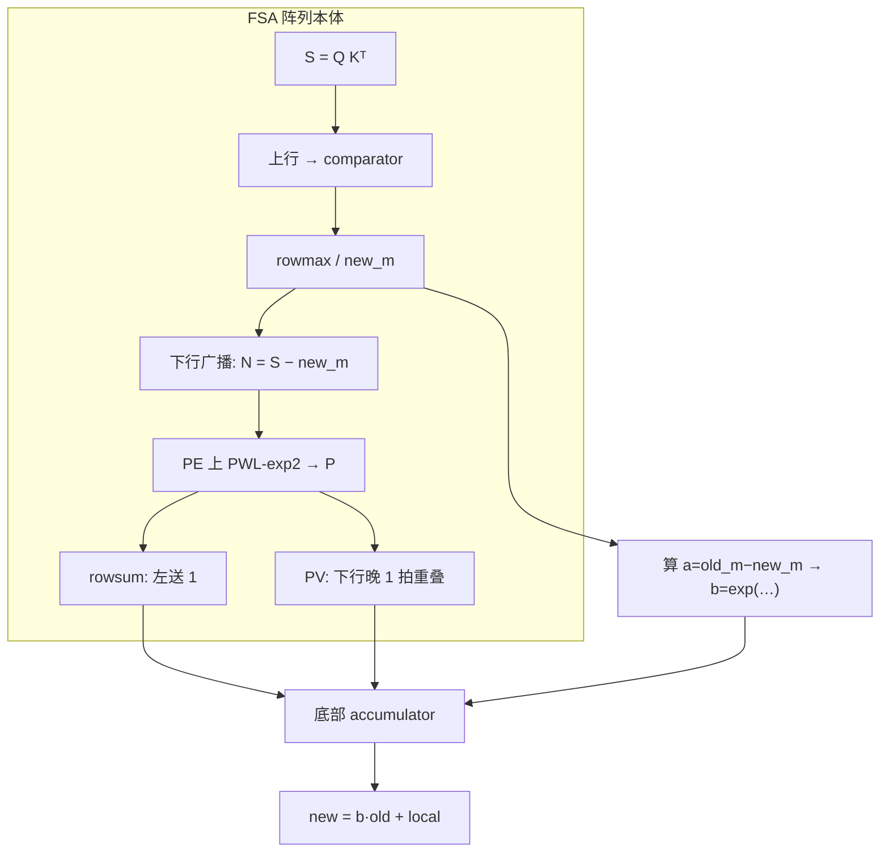

# FSA 映射思考：rescale 如何嵌入阵列

> 阵列跑通后带着问题重读 [FSA / SystolicAttention](https://arxiv.org/abs/2507.11331)（§2–3、Alg.1、Fig.3/7）。  
> 公式对照 P1：[online_softmax_rescale_notes.md](../p1_attention_numerics/online_softmax_rescale_notes.md)。  
> 本稿只谈**映射与缺口**，不写新 RTL。

## 带着 4×4 阵列提出的问题

我们的模块 C（[`systolic_array.md`](systolic_array.md)）是**标准 weight-stationary GEMM**：

- 西侧 skew 进 $A$，权重预载，psum 下行，底边 deskew 出 $C$；
- $\mathrm{LAT}=2(N{-}1)+1$，无上行路径、无底部可回读的 accumulator SRAM、PE 只会 MAC。

于是读 FSA 时盯住：

1. $\alpha$（论文里的 $b$）**乘在哪**——PE 里、底边、还是片外？
2. $\alpha$ **何时就绪**，如何与 $PV$ / rowsum 的 skew 波前对齐？
3. 相对「两次无关 GEMM」，SystolicAttention **少掉的拍数**从哪来？
4. P4 的 A/B/C 离「整段 FA 进阵列」还差哪些硬件？

## 结论先说

**块间 rescale（$\ell,O$ 换 max 基准）不在 PE mesh 的 MAC 数据路上完成，而在阵列底部的 accumulator：在 $local_\ell$、$local_O$ 从底边流出后，做**

$$
\ell\leftarrow b\cdot\ell+local_\ell,\qquad
O\leftarrow\mathrm{diag}(b)\,O+local_O
$$

其中 $b=\exp((m-m^{\mathrm{new}})/\sqrt{d})$（FSA Alg.1；与 P1 的 $\alpha=\exp(m-m^{\mathrm{new}})$ 同族，差别是论文把 $1/\sqrt{d}$ 折进 exp 前的缩放）。  
**最终** $O\leftarrow\mathrm{diag}(\ell)^{-1}O$ 在每个 **$Q$ tile 外层循环结束**时再做一次（论文称 re-scaling 约 $2N{+}20$ 拍；勿与每 KV 块的 $b\cdot(\ell,O)$ 混淆）。

## FSA 相对标准 WS 多出来的三块（回顾）

| 扩展 | 作用 | 我们的 4×4 |
|------|------|------------|
| **上行 datapath** | $S$ 列向送顶做归约，再把值送回阵列 | 无；结果只出底边 |
| **顶部 comparator** | 在线 $old_m/new_m$，下发 $new_m$ 与 $a$ | 无；模块 B 在阵列外做单行 $m/\ell$ |
| **PE + PWL** | 复用乘法器做 8 段 $\mathrm{exp2}$ | PE 仅 INT8 MAC；模块 A 独立流水 |

标准 WS 的「底边 Accumulation SRAM + merge」在 TPU 叙事里本就存在（$C{+}\!=AB$）；FSA 把它升级为 **带 $b$ 的 online 状态 merge**，从而吃下 FlashAttention 的块间依赖。

## Rescale 在调度里的位置（Fig.7 直觉）

单次内层（一个 $N\times N$ KV tile，预载 $Q$ 后）粗序：

1. $S=QK^\top$（故意先送 $K$ 末列，让 $S$ **首行尽早**进 comparator）。
2. 首个 $S$ 进顶即开 rowmax（约 $N$ 拍）；$S$ 回灌驻留，$\mathrm{new}_m$ 下行 → 就地 $N=S-\mathrm{new}_m$。
3. 并行：$a=\mathrm{old}_m-\mathrm{new}_m$ 送往 **accumulator**；阵列内 $N\cdot\log_2 e/\sqrt{d}$。
4. 约 8 拍 PWL → $P$；接着 **rowsum**（左恒 1、上恒 0）与 **$PV$**（下行晚 1 拍）重叠。
5. $local_\ell$、$local_O$ 出底边后，accumulator 用已就绪的 $b$ 做 merge，写回 acc SRAM。

量级：内层约 **$5N+10$** 拍；朴素两次无关 GEMM 约 **$8N-2$**（含 preload/skew）。省下的主要是：**不把 $S/P$ 卸到外部 vector 再装回**，以及 rowsum∥$PV$、rowmax 与后续算术的细粒度重叠。

### 和我们 skew / deskew 经验的对照

| 点 | 模块 C 练手 | FSA 内层 |
|----|-------------|----------|
| 对齐目标 | 整行 $C$ 同拍出（deskew） | $S$ **按行**尽早进顶；列序可打乱 |
| 延迟敏感量 | `valid_a`→`valid_c` 的 $\mathrm{LAT}$ | comparator / $b$ 必须在 merge 前就绪 |
| 底边角色 | 只出 GEMM 结果 | 出 $local$，**再**与 $b\cdot old$ 合并 |
| TB 教训 | 喂数与收数须重叠 | 内层同样是流水重叠；漏采/气泡会直接吃掉利用率 |

## 与 P4 三模块的一一映射

| FA / FSA 步骤 | 落点（论文） | P4 现状 | 缺口 |
|---------------|--------------|---------|------|
| $S=QK^\top$ | WS MAC，$Q$ 驻留 | 模块 C 会 GEMM | 无上行；无「$S$ 驻留后再减 $m$」模式 |
| rowmax | 顶 comparator | 模块 B 块内 $m$（片外） | 缺阵列顶归约 + 与 mesh 同期 |
| $S-m$，$\times\log_2e/\sqrt{d}$ | 下行广播 + MAC | 无 | 需可切换的 add/sub 路径 |
| $\exp$ / $\mathrm{exp2}$ | PE 内 8 段 PWL | 模块 A 独立 16 段 PWL | 嵌进 PE、系数流式灌入 |
| $\alpha$/ $b$ | comparator → **accumulator** | 模块 B 对 $\ell$ 做 $\alpha\cdot\ell$ | **缺对 $O$ 的 $\mathrm{diag}(b)$**；未接底边 |
| rowsum | 阵列当「×1 归约」 | 模块 B 累加 $\sum\exp$ | 可用 C 复现，但未接 B |
| $PV$ + merge | 阵列 + **acc 乘加 $b$** | 仅裸 GEMM | **rescale 嵌入的关键缺口** |
| $O/\ell$ | 外层结束，acc 侧 | 无 | 倒数 × 向量乘 |

模块 B 已覆盖「单行、无 $O$」的 online 骨架；FSA 的完整故事是：**同一套底边状态**同时持有 $\ell$ 与 $O$，且 $b$ 与 $local_O$ 在同一 merge 点会合。

## 主线 1 可落的设计选项（思考，非本周实现）

1. **FSA 同款（推荐作架构基线）**  
   Mesh 产 $local$；**accumulator 行**做 $b\cdot old + local$。$\alpha$ 来自顶侧 max 路径（或模块 B 扩展），按行广播到 $d$ 个通道。与「rescale 是块间唯一串行依赖」（P1 笔记）一致：块内 MAC 仍满，块间等 $b$。

2. **Softermax 变体**  
   整数 max → $\Delta m\in\mathbb{Z}$，底为 2 时 $b$ 变**移位**，accumulator 更轻；代价是算法/微调约定（见 reading_notes Softermax）。

3. **PLENA 式**  
   不坚持单阵列熔断：matrix 做两段 GEMM，vector/scalar 做 max/sum/exp/div。P4 积木仍有用，但 **rescale 不嵌进 mesh**。

## 明确不在本稿范围

- 不改 `pe.sv` / 不加 accumulator RTL。  
- 不声称 FSA 开源与我们 INT8 4×4 周期兼容。  
- 波形/覆盖率与 `fsa_mapping` 分开，留 P4 收尾。

## 读后自检

1. 若只有模块 C、把 softmax 卸到外部：中间 $S$/$P$ 必经 SRAM 往返 → 正是 FSA Fig.1 要打的利用率洞。  
2. 「rescale 嵌进阵列」≠「在每个 PE 里乘 $\alpha$」；正确图像是 **底边（或近存）accumulator 的一次融合写回**。  
3. 下一步若做原型：优先 **底边 acc + $b$ 乘加端口** 接上模块 B 的 $\alpha$，再考虑上行/PWL 进 PE。
