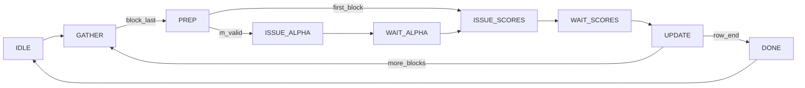

# softmax_unit 设计笔记（模块 B）

> 实现笔记。公式推导见 P1 [online_softmax_rescale_notes.md](../p1_attention_numerics/online_softmax_rescale_notes.md)；`exp` 单元见 [exp_unit.md](exp_unit.md)。

## 范围

单 attention **row** 的 online softmax **归约**：维护 running max $m$ 与 running sum $\ell$，**不做** $O\leftarrow\alpha O+PV$。例化 [`exp_approx`](../exp_unit/exp_approx.sv)。

$$
m^{\mathrm{new}}=\max(m,\max_j S_j),\quad
\alpha=\exp(m-m^{\mathrm{new}}),\quad
\ell\leftarrow\alpha\cdot\ell+\sum_j\exp(S_j-m^{\mathrm{new}})
$$

## 接口

| 信号 | 方向 | 说明 |
|------|------|------|
| `start` | in | 脉冲：新 row，清 $m/\ell$ |
| `score_valid` / `score` | in | Q6.10 分数流 |
| `block_last` / `row_last` | in | 块/行边界（`row_last` ⇒ 末块） |
| `accept_score` | out | 高电平表示处于 GATHER，可送分 |
| `busy` / `done` | out | 忙；完成时 1 拍脉冲 |
| `m_out` | out | 最终 $m$，Q6.10 |
| `l_out` | out | 最终 $\ell$，UQ8.24 |

参数 `MAX_BLOCK=32`：块缓冲深度。

## 状态机

1. **GATHER**：写入 `score_mem`，在线求块内 `m_blk`。
2. **PREP**：`m_new = max(m, m_blk)`（首块则 `m_new = m_blk`）。
3. **ALPHA**：若非首块，向 `exp_approx` 送 `m - m_new`，用返回的 $\alpha$（UQ0.24）做 $\ell\leftarrow\alpha\cdot\ell$（`>>24`）。
4. **SCORES**：逐个送 `s - m_new`，累加 $\sum\exp$（流水线吞吐，延迟 3 拍）。
5. **UPDATE**：$\ell\leftarrow\ell+\mathrm{sum}$，提交 $m\leftarrow m^{\mathrm{new}}$；若 `row_last` 则 **DONE**。

## 定点约定

| 量 | 格式 |
|----|------|
| $S$, $m$ | Q6.10 |
| $\exp(\cdot)$, $\alpha$ | UQ0.24（经 `exp_approx`） |
| $\ell$ | UQ8.24（32-bit，与 UQ0.24 同小数位） |

比特级 golden：[`scripts/softmax_rtl_model.py`](../scripts/softmax_rtl_model.py)。向量来自 P1 风格 score 行：[`scripts/online_softmax_golden.py`](../scripts/online_softmax_golden.py)（因果下优先长行）。

## 对拍结果（`make sim-softmax`）

- 配置：因果 attention 末行，$n=64$，`block_size=8`（8 个块）。
- DUT vs golden：**$m$、$l$ 比特一致**。
- 跨块大小：同一行上 $m$ 完全一致；$\ell$ 相对偏差 $<1\%$（定点 + 近似 $\exp$ 的非结合性，笔记如实记录）。
- 相对 `math.exp` 全局 softmax：$m$ 对齐，$\ell$ 相对误差约 $2.5\times10^{-4}$（信息性）。

## 文件

| 路径 | 角色 |
|------|------|
| [`../softmax_unit/online_softmax.sv`](../softmax_unit/online_softmax.sv) | DUT |
| [`../tb/tb_softmax.sv`](../tb/tb_softmax.sv) | TB |
| [`../scripts/softmax_rtl_model.py`](../scripts/softmax_rtl_model.py) | 比特级 golden |
| [`../scripts/online_softmax_golden.py`](../scripts/online_softmax_golden.py) | P1 score 行采样 |
| [`../scripts/gen_vecs_softmax.py`](../scripts/gen_vecs_softmax.py) / [`compare_softmax.py`](../scripts/compare_softmax.py) | 向量 / 比对 |

## 简化与后续

- 无 PV / $O$ 累加器；接主线 1 阵列时需扩展 UPDATE 路径。
- `MAX_BLOCK` 内缓冲；更长块需加大参数或改流式两遍扫描。
- $\ell$ 位宽按短行（$n\lesssim 256$）选择；更长序列可扩到 UQ16.24。
