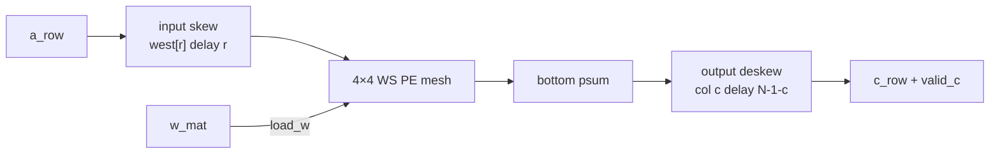

# systolic_array 设计笔记（模块 C）

> 4×4 weight-stationary INT8 阵列：输入 skew、输出 deskew，与 numpy `A@W`（INT32 累加）比特对拍。

## 范围

$$
C = A\,W,\quad A\in\mathbb{Z}^{M\times 4},\ W\in\mathbb{Z}^{4\times 4},\ C\in\mathbb{Z}^{M\times 4}
$$

输入 INT8，MAC 累加 INT32。**不做**量化 scale / attention 映射（见后续 FSA mapping 笔记）。

| 文件 | 作用 |
|------|------|
| [`pe.sv`](../systolic_array/pe.sv) | 单 PE：`w` 驻留；`a` 左→右；`psum` 上→下 |
| [`systolic_array.sv`](../systolic_array/systolic_array.sv) | 4×4 mesh + skew/deskew + `valid_c` |
| [`systolic_rtl_model.py`](../scripts/systolic_rtl_model.py) | 周期模型（与 RTL NBA 语义对齐） |
| `make sim-sa` | gen → Verilator → `compare_sa` vs numpy |

## 接口

| 信号 | 方向 | 说明 |
|------|------|------|
| `load_w` | in | 1 拍：并行装入 `w_mat[r][c]` 到各 PE |
| `w_mat` | in | $4\times 4$ INT8 权重 |
| `valid_a` / `a_row` | in | 每拍一行激活（$K{=}4$） |
| `valid_c` / `c_row` | out | deskew 后的一行 $C$，与 `valid_a` 流水对齐 |

## 数据流

- **Input skew**：行 $r$ 的激活延迟 $r$ 拍再进西侧，使对角波前对齐。
- **PE**：`psum_out <= psum_in + a_in * w_reg`；`a_out <= a_in`（均寄存器）。
- **Output deskew**：列 $c$ 相对底边再延迟 $N-1-c$ 拍，使同一逻辑行的四列同时出。

## 延迟

概念上首行结果约在 issue 后 $2(N-1)$ 拍对齐。综合 RTL 中 `always_ff` 采到底边 **PE 更新前** 的 `bottom`（与 NBA 同拍），因此：

$$
\mathrm{LAT} = 2(N-1)+1 = 7\quad (N{=}4)
$$

`valid_c` 为深度 `LAT` 的 `valid_a` 移位。周期模型常量 `LAT` 与之相同。

## 对拍结果

| 项 | 结果 |
|----|------|
| 向量 | $M{=}8$，$A$ 含角点行 $[-128,-1,0,127]$ |
| `systolic_ws_sim` vs `gemm_int8` | 一致 |
| DUT vs numpy | **0 / 32 mismatch**（`make sim-sa` PASSED） |

## TB 注意

喂数与收数必须重叠：首拍 `valid_c` 可在仍在送 $A$ 时出现；若先喂完再采，会漏 1 行（曾表现为 `n_out=7`）。

## 未做 / 后续

- 更大 $N$、双缓冲权重、输出 FIFO
- rescale / online softmax 如何接底边 → 见 [fsa_mapping.md](fsa_mapping.md)
- 波形/覆盖率简报（P4 收尾）
