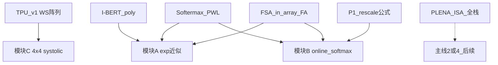

# P4 阅读笔记（Week 0）

> 对应 [PLAN.md](PLAN.md) 阅读材料。
> 目标：建立写 RTL 前的架构 / exp / systolic 概念框架；不必通读原文。
> online softmax 的 rescale 公式完整推导见 P1：[online_softmax_rescale_notes.md](../p1_attention_numerics/online_softmax_rescale_notes.md)。
>
> **建议阅读顺序**（与章节编号可不同）：TPU v1 → Softermax / I-BERT → FSA → PLENA。
> 先建立 WS 阵列与 exp 近似心智模型，再看「如何把 FlashAttention 嵌进阵列」，最后对照全栈方案。

---

## 1. FSA / SystolicAttention（Lin et al., arXiv:2507.11331）

**回答什么问题**：传统 WS systolic 擅长连续大 GEMM；FlashAttention 在两段 GEMM（$QK^\top$ 与 $PV$）之间夹着 row-max / exp / row-sum / rescale。若把 softmax 卸到片外 vector/scalar 单元，会出现：

1. **吞吐不匹配**：vector 跟不上阵列 → 阵列空转（论文 Figure 1：NeuronCore-v2 上 tensor engine 活跃约 45%，scalar 约 80%）。
2. **往返破坏复用**：中间结果经 SRAM 在阵列与 vector 间来回，无法跨迭代复用矩阵数据，SRAM 端口争用加剧。

**核心主张**：在**单个**增强型 systolic 阵列（**FSA**）上跑完整 FlashAttention，**不依赖外部 vector 单元**；配套内核 **SystolicAttention** 在同一次 FA 迭代内细粒度重叠运算，并保持与 FlashAttention 相同的浮点运算顺序。

### 相对标准 WS 阵列多了什么（精读重点：架构图 §3.1 / Fig.3）

| 扩展 | 作用 |
|------|------|
| **上行 datapath** | 列数据可双向流动，把刚算出的 $S$ 行送回阵列上方 |
| **顶部 comparator 阵列** | 就地做列/行方向的 on-the-fly **rowmax** 归约 |
| **PE 增加 PWL 能力** | 复用 MAC 做 $\mathrm{exp2}$ 的分段线性近似 |

### 非 GEMM 如何落在阵列上

**rowmax**（§3.2）：把 $Q$ 的行映射到阵列列，使 $S=QK^\top$ 的行沿列产生；经上行路径送 comparator，维护 $old_m$ / $new_m$，并把 $new_m$ 向下广播，在阵列内就地算 $N=S-new_m$。

**exp**（§3.3）：用 $\exp(x)=2^{x\log_2 e}$（与官方 FA 实现一致）。因 $N\le 0$，令 $x=x_i+x_f$、$x_f\in(-1,0]$，则

$$
2^{x} = 2^{x_i}\cdot 2^{x_f},\qquad 2^{x_f}\in(0.5,1]
$$

对 $2^{x_f}$ 用 **8 段均匀 PWL**；论文称最终 FA 相对误差约 $10^{-2}$ 量级。$2^{x_i}$ 只改结果指数。slope / intercept 从阵列左/上流入，避免在 PE 内长期存系数表。

**rowsum + $PV$**（§3.4）：左送常数 1、上送 0 做 $P$ 的行和；**晚 1 拍**即可沿下行路径开始 $O=PV$，与 rowsum 重叠。rescale（$\alpha$ 乘旧 $\ell,O$）主要在底部 **accumulator** 完成，每外层循环一次。

### SystolicAttention 调度直觉（§3.5 / Fig.7）

预载 $Q$ → $S=QK^\top$（故意先送 $K$ 的末列，使 $S$ 首行尽早出来）→ 立刻开 rowmax → 就地 $S-new_m$ → 并行做 $a=old_m-new_m$ 与 $\times\log_2 e/\sqrt{d}$ → PWL exp2（约 8 拍）→ rowsum 与 $PV$ 下行重叠。

量级：处理 $N\times N$ tile 约 **$5N+10$** 拍；朴素两次无关 GEMM 约 **$8N-2$** 拍（含 preload / skew 开销）。

**综合数字（了解即可）**：相对标准 WS 阵列约 **+12% 面积**（16 nm、1.5 GHz）；相对 Neuron-v2 / TPUv5e 报告更高 attention FLOPs/s 利用率。

**对 P4 的启示**：

- 模块 A（exp）≈ FSA 的 PWL-$\mathrm{exp2}$ 路径，可先做定点独立单元，不必一开始就嵌进 PE。
- 模块 B（online softmax）≈ comparator + rescale + sum 的**电路雏形**；P4 先做单 row 流式归约即可。
- 模块 C 先练标准 WS；**「rescale 如何嵌进阵列」**在阵列跑通后写于 [`notes/fsa_mapping.md`](notes/fsa_mapping.md)。

链接：[arXiv:2507.11331](https://arxiv.org/abs/2507.11331) · [开源 FSA](https://github.com/VCA-EPFL/FSA)

---

## 2. PLENA（Wu et al., arXiv:2509.09505）

**回答什么问题**：长上下文 **agentic** 推理同时撞上 **带宽墙** 与 **容量墙**（KV 随序列膨胀、batch 被压小 →「瘦/胖」GEMM），方阵 systolic / Tensor Core 利用率差。PLENA 用三条 pathway 做硬件–软件协同。

### 三条优化路径

| Pathway | 内容 | 要记住的一句话 |
|---------|------|----------------|
| 1. **Flattened systolic** | 阵列几何拉长：$\texttt{BLEN}\ll\texttt{MLEN}$，偏 **output-stationary**，适配小 batch × 大 reduction | 同一乘法器数量下，对 fat GEMM 利用率高于方阵 |
| 2. **Asymmetric quantization** | W / A / KV 不同精度；片上激活可更高精度，W/KV 用可配置 **MX**；可选 Hadamard 旋转抑 outlier | 省带宽与 HBM 容量，为更大 batch 腾空间 |
| 3. **Native FlashAttention** | ISA + 可转置 Matrix SRAM + vector/scalar 做 max/sum/exp/div + tile 级 prefetch 重叠 | **不把整段 FA 硬焊进单一阵列**，而用可编程细粒度编排 |

### 与 FSA 的关键差异（P4 必辨）

| | FSA / SystolicAttention | PLENA |
|--|-------------------------|-------|
| Softmax / 非 GEMM | **嵌进同一 systolic**（少/无外部 vector） | **Matrix + Vector + Scalar** 分工；softmax 偏 vector/scalar |
| 阵列形状 | 方阵增强（上行路径 + comparator + PWL PE） | **Flattened** 子阵列 + 跨阵列 adder tree（`M_SUM`） |
| 软件栈 | 自定义 kernel / Python 接口 | **完整 ISA + 编译器 + 事务级模拟器 + DSE + RTL** |
| 精度故事 | 保持 FA 浮点运算顺序；PWL exp | 非对称 MX + PTQ（含旋转等）贯穿 |

论文自陈相对 SystolicAttention：PLENA 更灵活（prefetch 重叠、混合精度 flattened、head 级分解）。对主线 1，FSA 更贴近「in-place online softmax 阵列」；对主线 2/4，PLENA 的 MX + ISA/编译器是更完整的全栈对标。

### FlashAttention 原生支持需要的四类能力（§III-F，对照检查表）

1. 片外 load 与计算的 **tile 级重叠**（prefetch）。
2. **transpose-on-read** / 跨步流式（服务 $QK^\top$）。
3. 行向 **reduction + 非线性**（max / sum / exp / div）——PLENA 放在 vector/scalar，位宽可配（softmax 常用更高精度）。
4. ISA 允许 **tile-by-tile 融合调度**，而非粗粒度 kernel 边界。

ISA 粗分类（Table I）：Matrix / Vector / Scalar / HBM / Control；attention 示例见图 8 的指令前缀编排。

**对 P4 的启示**：P4 练的是「积木」（exp、softmax 归约、小 WS 阵列），不是完整 PLENA。读 PLENA 是为了知道积木之后往 **ISA + 编译映射 + 非方阵几何** 演化；P5 / 主线 4 再碰 tile 搜索与指令流。

链接：[arXiv:2509.09505](https://arxiv.org/abs/2509.09505)

---

## 3. Softermax（Stevens et al., DAC 2021）与 I-BERT（Kim et al., ICML 2021）

两篇都在解决：**softmax / exp 在硬件上又贵又拖流水**，以及「数值稳定需要减 max」带来的额外扫描。选型上对 P4 模块 A/B 直接有用。

### 3.1 Softermax（arXiv:2103.09301）

**四招**：

1. **换底**：$\mathrm{softmax}$ 用 $2^{x}$ 代替 $e^{x}$（仍保持概率、可微、拉开差距等性质，更贴硬件）。
2. **全路径低精度定点**：含幂、累加、除法（需定制电路，通用 CPU/GPU 拿不到同等收益）。
3. **Online normalization**（同源自 Milakov & Gimelshein）：流式维护 running max 与 running sum，换 max 时对旧 sum **rescale**——与 P1 / FlashAttention 同族。
4. **Softermax-aware fine-tuning**：下游微调吸收近似误差（Transformer 本就要微调，不另加阶段）。

**硬件友好改动**：用 **integer max**，使 $\Delta m$ 恒为整数；底为 2 时 rescale 变成 **移位**，不必真做浮点乘。

**$\mathrm{exp2}$ 实现**：定点拆整数 / 小数；小数 $[0,1)$ 上 **4 段 LPW**（斜率 LUT × 小数 + 截距 LUT），再按整数部分移位。论文示例位宽（Table I）：输入 Q(6,2)、未归一 Q(1,15) 等。

**微架构拆分**：

- **Unnormed Softmax**：本地 max + $2^{x}$ + 分母累加（可塞进 PE 后处理）。
- **Normalization**：分子 rescale + 除法（可用 LPW 倒数 × 整数乘；可放在 PE 与全局缓冲之间）。

报告量级：相对 DesignWare 风格基线，Unnormed 单元约 **4× 面积、9.5× 能量**改善；放进加速器后约 **2.35× 能效、0.90× 面积**，精度经微调可忽略。

链接：[arXiv:2103.09301](https://arxiv.org/abs/2103.09301)

### 3.2 I-BERT（arXiv:2101.01321）

**回答什么问题**：端到端 **纯整数** Transformer 推理（含 GELU / Softmax / LayerNorm），避免非线性仍回浮点。

**i-exp 核心（模块 A 的另一条经典路）**：

1. 减 max 得 $\tilde{x}\le 0$。
2. 范围规约到一个周期：

$$
z=\left\lfloor -\tilde{x}/\ln 2\right\rfloor,\quad
p=\tilde{x}+z\ln 2\in(-\ln 2,\,0],\quad
\exp(\tilde{x})=2^{-z}\exp(p)
$$

3. 在 $(-\ln 2,0]$ 上用 **二次多项式** 逼近 $\exp(p)$（论文拟合形如 $L(p)=0.3585(p+1.353)^2+0.344$），再用移位实现 $2^{-z}$。
4. 宣称 $\exp$ 最大误差约 **$1.9\times 10^{-3}$**，与 INT8 量化台阶 $1/256\approx 3.9\times 10^{-3}$ 同量级，可吞进量化误差。

Softmax 累加等非线性用 **INT32**，MatMul/Embedding 用 **INT8**，再 requant——与「score 路径可低比特、归约保宽」的混合精度直觉一致。

链接：[arXiv:2101.01321](https://arxiv.org/abs/2101.01321) · [PMLR 版本](https://proceedings.mlr.press/v139/kim21d.html)

### 3.3 对 P4 模块 A/B 的选型对照

| 方案 | 规约 | 小数/残余逼近 | 与 online 的关系 | P4 默认倾向 |
|------|------|---------------|------------------|-------------|
| Softermax | 换底 $2^{x}$ + 整/小数拆分 | **PWL（少段 LUT）** | 内建 online + 移位 rescale | 与 FSA 的 8-段 PWL-$\mathrm{exp2}$ 最近 |
| I-BERT | $\ln 2$ 周期规约 | **二次多项式** | 经典减全局 max；多项式服务 i-exp | 误差标称已 $<10^{-3}$，可作对照黄金 |
| FSA | $\mathrm{exp2}$ + $x_i/x_f$ | **8 段 PWL**（浮点输入版） | 嵌在阵列调度里 | 架构目标读物 |

**P4 计划默认**：Python 先做 **范围规约 + PWL**（Softermax/FSA 路线），误差预算对齐学习计划（目标域相对误差 $<10^{-3}$，必要时加段数或对照 I-BERT 多项式）。用 **真实 attention score**（减 max 后）评估，而非均匀随机。

---

## 4. TPU v1（Jouppi et al., ISCA 2017）

**回答什么问题**：数据中心 NN **推理** ASIC 如何用超大 MAC 阵列换能效；论文是 **weight-stationary systolic** 的工业原型叙事。

### 矩阵单元心智模型（模块 C 精读重点）

| 要素 | TPU v1 典型数字 / 行为 |
|------|------------------------|
| 阵列 | **$256\times 256$** INT8 MAC → 每拍 65,536 次乘加；峰值约 **92 TOPS**（@700 MHz） |
| Dataflow | **Weight-stationary**：权重预载进阵列；激活从一侧流入；部分和在阵列内累加后进入底部 **Accumulators**（256 路 × 32-bit） |
| 存储 | **Unified Buffer** ~24 MiB（激活）；**Weight FIFO**（多 tile，隐藏从 Weight Memory 搬入的延迟）；权重侧另有大容量 DRAM |
| 执行哲学 | CISC 指令让 **Matrix Unit 尽量不停**；`Read_Weights` 等与计算解耦；激活函数等在 Accumulator 之后的单元做 |

**Systolic 为何省能**：大 SRAM 读写远比算术贵；数据在相邻 PE 间短线传递，同一权重驻留复用，减少 Unified Buffer 往返（论文 Figure 4 的「波前」图）。

**与 P4 4×4 练手的直接对应**：

1. **预载权重** → 激活按行（带 **skew**：第 $i$ 行延迟 $i$ 拍）流入。
2. 部分和向下（或向累加器）流出，输出侧常需 **deskew**。
3. 总拍数直觉（与 FSA §2.1 一致）：MAC 有效约 $M$ 拍时，preload + 输入/输出对齐开销约 $O(N)$，利用率 $\approx M/(M+3N-1)$；$M\gg N$ 时开销可忽略——这也解释 decode 瘦矩阵为何利用率差（呼应 P3）。

**TPU 不做的事（对照 FSA/PLENA）**：v1 面向 MLP/CNN/LSTM 推理，**没有** FlashAttention / online softmax 融合；非线性在阵列外 Activate 单元。P4 的模块 C 先复现「经典 WS GEMM」，模块 A/B 补上 attention 非 GEMM——正是主线 1 相对 TPU 基线要多出来的部分。

链接：[arXiv:1704.04760](https://arxiv.org/abs/1704.04760)

---

## 5. 四篇如何映射到 P4 三个模块

| P4 模块 | 主要阅读锚点 | 实现时记住的约束 |
|---------|--------------|------------------|
| A. exp | Softermax / I-BERT / FSA §3.3 | 输入域以 $x-m\le 0$ 为主；先 Python 扫参再 RTL |
| B. online softmax | P1 rescale 笔记 + Softermax online + FSA comparator/accumulator | 任意分块结果一致；定点 $\ell$ 保宽 |
| C. systolic | TPU v1 + FSA §2.1 | INT8×INT8→INT32；skew/deskew；与 numpy 比特一致 |
| 跑通后 | FSA 调度图 + 对照 PLENA 差异 | 写 `notes/fsa_mapping.md`，勿与本周概念笔记混写 |

---

## 6. 两道自检题

### Q1：为什么「传统 WS 阵列 + 外部 softmax」跑 FlashAttention 容易利用率低？

FA 在 $QK^\top$ 与 $PV$ 之间需要 row-max / exp / row-sum / rescale。外部 vector 若 FLOPs/s 不足会卡住阵列；即使 vector 够快，中间结果经 SRAM 往返也会打断数据驻留与双 GEMM 之间的复用。FSA 的回答是把这些算子 **挪进同一阵列** 并重叠调度；PLENA 的回答是 **ISA + vector/scalar + prefetch**，不坚持单阵列熔断一切。

### Q2：P4 的 exp 为何优先 PWL + 换底/$\mathrm{exp2}$，而不是直接调浮点 $\exp$？

硬件上 $2^{x}$ 可拆成「整数移位 + 小数逼近」；attention 减 max 后 $x\le 0$，小数域有界，少段 PWL（Softermax 4 段 / FSA 8 段）或短区间二次式（I-BERT）即可把误差压到约 $10^{-3}$。这与模块 A 的「范围规约 + 分段/多项式 + 定点流水」验收路径一致，也便于之后像 FSA 一样把近似嵌回 MAC 阵列。
