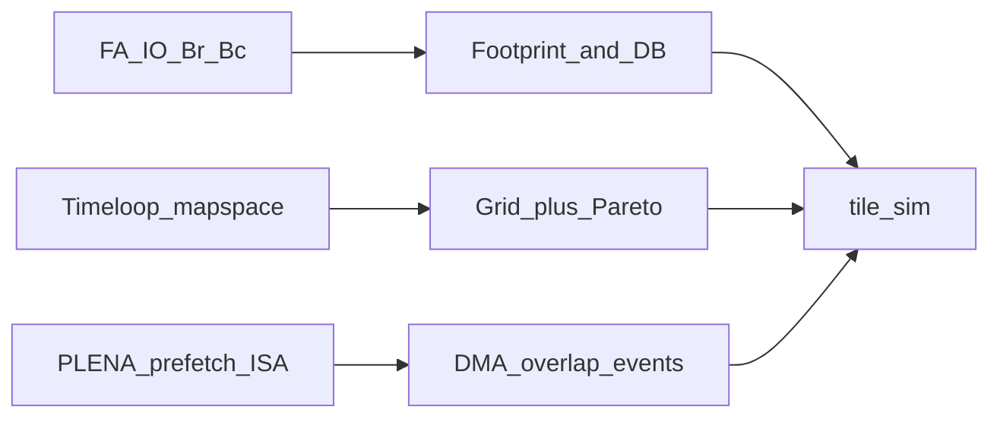

# P5 阅读笔记（Week 0）

> 对应 [PLAN.md](PLAN.md) 阅读材料。
>
> **交叉引用（避免重抄）**：
> - FA Algorithm 1 / rescale：P1 [reading_notes.md](../p1_attention_numerics/reading_notes.md)、[online_softmax_rescale_notes.md](../p1_attention_numerics/online_softmax_rescale_notes.md)
> - Timeloop 工具用法（YAML / mapper 命令）：P3 [reading_notes.md](../p3_arch_eval/reading_notes.md) §3
> - PLENA 阵列几何与 FSA 对照：P4 [reading_notes.md](../p4_rtl/reading_notes.md) §2；rescale 阵列映射：[fsa_mapping.md](../p4_rtl/notes/fsa_mapping.md)
>
> **建议阅读顺序**：FlashAttention IO 分析 → Timeloop mapspace → PLENA ISA / 编译器。

---

## 1. FlashAttention IO 与 tile–SRAM（Dao et al., NeurIPS 2022）

**本笔记精读**：§3.1 Algorithm 1 的块尺寸选择、§3.2 IO 复杂度（Theorem 2 / Prop. 3）、Fig. 2 中「块越大 → HBM 越少 → 直到塞不进 SRAM」的经验曲线。  
数值算法本身见 P1；此处只抽 **对性能模型有约束力的公式**。

### 1.1 合法块尺寸与外层 / 内层循环

给定 on-chip SRAM 容量 $M$（元素计，与论文一致），Algorithm 1 设：

$$
B_c = \left\lceil\frac{M}{4d}\right\rceil,\qquad
B_r = \min\!\left(\left\lceil\frac{M}{4d}\right\rceil,\, d\right)
$$

并把 $Q$ 切成 $T_r=\lceil N/B_r\rceil$ 块、$K/V$ 切成 $T_c=\lceil N/B_c\rceil$ 块。

论文 Fig. 1 / Alg.1 的调度直觉（与 GPU 实现细节可略有出入，**语义**对硬件建模够用）：

| 循环 | 扫什么 | 典型驻留 |
|------|--------|----------|
| 外层（或 KV 主导循环） | $K_j,V_j$ 装入 SRAM | 一块 KV 可被多个 $Q$ 块复用 |
| 内层 | $Q_i$（及 running $O_i,m_i,\ell_i$） | 每块算完可写回 HBM |

**块间依赖**（与 P1 一致）：同一 $Q$ 行上，跨 $KV$ 块的 $(m,\ell,O)$ 必须串行 rescale；块内 $QK^\top$ / softmax / $PV$ 可并行。

Decode：$N_q=1$ ⇒ 有效 $B_r=1$（或整段 $Q$ 只有一行），只剩 $\lceil N/B_c\rceil$ 个 KV 块。

### 1.2 Footprint（P5 用）

单 head、单缓冲，驻留一块 $Q$、一块 $K$、一块 $V$、一块部分 $O$（统计量 $m/\ell$ 可忽略或占极小固定额）：

$$
\mathrm{Footprint}
= B_r\cdot d\cdot b_Q
+ B_c\cdot d\cdot (b_K+b_V)
+ B_r\cdot d\cdot b_O
$$

其中 $b_\cdot$ 为每元素字节数（混合精度钩子）。论文启发式 $M/(4d)$ 来自「大约四块 $B\times d$ 矩阵」的量级；**P5 用显式 footprint，不用死套 $4d$**，但量级应对齐。

Double buffering（掩盖 DMA）：保守规则要求 $2\cdot\mathrm{Footprint}\le M_{\mathrm{SRAM}}$；不满足则退化为串行 `DMA → compute → DMA`。

### 1.3 IO 复杂度（Theorem 2）

在 $d\le M\le Nd$ 时：

| 算法 | HBM 访问量（量级） |
|------|-------------------|
| 标准 attention | $\Theta(Nd + N^2)$（物化 $S,P$） |
| FlashAttention | $\Theta(N^2 d^2 / M)$ |

证明直觉：每次装入 $\Theta(M)$ 的 $K/V$ 块后，要对全部 $Q$ 扫一遍 ⇒ 约 $\Theta(Nd/M)$ 遍扫 $Q$，每遍 $\Theta(Nd)$ ⇒ 总 $\Theta(N^2 d^2/M)$。  
**推论（直接进模拟器）**：在 SRAM 允许范围内 **增大合法 tile ⇒ 减少扫遍次数 ⇒ traffic↓**；超过 $M$ 则非法。

Proposition 3：不存在对所有 $M\in[d,Nd]$ 都渐近优于 $\Theta(N^2 d^2/M)$ 的精确 attention 算法——说明「靠更大 SRAM / 更好 tiling 降 IO」是正道，而不是另找渐近魔法。

### 1.4 两端劣化（Fig. 2 middle → P5 验收现象）

1. **Tile 过小**：$B_c$ 小 ⇒ 扫遍多、HBM 访问多；DMA 时间相对 compute 变长，**无法被 compute 掩盖**（util↓、latency↑）。
2. **Tile 过大**：塞不进 SRAM；或逼近上限时只能单缓冲 → **失去 overlap**，相对中等 tile 劣化。

中间存在「HBM 已够少、算术开始主导」的平台区——P5 的 Pareto / 最优 $(B_r,B_c)$ 就落在这类折中附近。

链接：[arXiv:2205.14135](https://arxiv.org/abs/2205.14135)

---

## 2. Timeloop mapspace → P5 极简 mapper（Parashar et al., ISPASS 2019）

**本笔记精读**：mapspace 三子空间、constraints、mapper↔model 共生；**不**重复 P3 的 YAML 跑通步骤。

### 2.1 核心主张

DNN 加速器没有统一 ISA 接口时，**architecture 与 mapping 必须一起评估**：

- 没有 mapper，模型无法对某个 arch「公平」取最优调度；
- 没有快速准确的 cost model，mapper 无法在巨大 mapspace 里筛选。

Timeloop 把二者拆开：`mapping` 是接口；`mapper` 搜 mapspace；`model` 用解析方法估 latency / energy（非 cycle-accurate RTL）。

### 2.2 Mapping = 带注解的 loop nest

每一级存储（及 spatial fanout）对应一个 **tiling level**，每级对每个问题维有：

| 概念 | 含义 |
|------|------|
| **temporal `for`** | 时间上扫子 tile；delta 空 ⇒ 完美复用（stationary） |
| **spatial `parallel_for`** | 空间上把维摊到 PE / 阵列轴；支持 multicast / forward |
| **factors** | 该级各维循环上界（tile 因子） |
| **permutation** | 该级内循环嵌套序 |
| **bypass** | 某张量是否跳过该级缓冲（腾容量给更值得驻留的张量） |

Dataflow（WS / OS / RS…）在 Timeloop 里不是魔法标签，而是一组 **mapspace constraints**（固定某些 factor / permutation / spatial 轴）。

### 2.3 Mapspace 三子空间

未约束 mapspace ≈ 笛卡尔积：

1. **IndexFactorization**：各问题维在各级之间的因子分解  
2. **LoopPermutation**：每级内循环排列  
3. **LevelBypass**：各级是否驻留各张量  

用户 constraints 剪枝；采样后还要做 **硬件容量检查**（tile 是否装进该级 SRAM）——装不下则拒绝。搜索可用穷举或随机采样；目标常为 energy-delay 等。

论文提醒：仅最小化 DRAM 次数不够——大量 mapping 可有相同 DRAM 访问却能量差一个数量级（片上缓冲访问同样贵）。P5 双目标（latency × traffic）是同族问题的简化版。

### 2.4 对照表：Timeloop ↔ P5 tile_sim

| Timeloop | P5 模拟器 |
|----------|-----------|
| problem（如 GEMM $M,N,K$） | `workload`：prefill/decode、$N$、$d$、heads、字节数 |
| architecture | `hw_config`：PE、SRAM、DRAM BW、softmax 吞吐 |
| IndexFactorization 的一部分 | 网格上的 $(B_r,B_c)$ |
| spatial 展开 / PE 几何 | 粗粒度 `macs_per_cycle`（不做 skew/stationary 细模） |
| LevelBypass / 多级缓冲 | 单层 SRAM + 是否 double buffer |
| mapspace constraints | 合法性：`Footprint`（及 $2\times$）$\le$ SRAM；decode 强制 $B_r=1$ |
| analytical cost model | `simulator`：DMA / compute / store 事件 + 可选重叠 |
| mapper 搜索 | `search`：网格 + latency–traffic Pareto |
| Accelergy 能量 | **本周不做**（P3 已有；P5 聚焦 latency/traffic） |

一句话：**P5 = 面向 FlashAttention 数据流的极简 Timeloop**——mapspace 从「7 维 CNN × 多级存储」缩成「两维 tile × 一层 SRAM × DB 开关」。

链接：[ISPASS PDF](http://www.parashar.org/ispass19.pdf) · [arXiv/DOI 入口](https://doi.org/10.1109/ISPASS.2019.00042)

---

## 3. PLENA 编译器 / ISA（Wu et al., arXiv:2509.09505）

**本笔记精读**：§III-D ISA、§III-F FlashAttention 四项能力、§III-G 编译与仿真栈。  
阵列 flattened / MX 量化见 P4；此处只谈 **软件如何把 tile 选择变成可执行调度**。

### 3.1 ISA 五类（Table I）

| 前缀 | 职责 | 与 attention 的关系 |
|------|------|---------------------|
| **Matrix (M)** | GEMM/GEMV，可选转置 | $QK^\top$、$PV$、投影 |
| **Vector (V)** | 逐元素、归约、旋转 | row-max / exp / sum / 量化前 Hadamard |
| **Scalar (S)** | 标量算术、地址 | 循环边界、指针、$m/\ell$ 标量更新 |
| **HBM (H)** | HBM ↔ Matrix/Vector SRAM | `H_LOAD_M` / `H_LOAD_V` 等，**与 compute 并行的 prefetch** |
| **Control (C)** | 嵌套循环配置、HBM 地址等 | tile 级编排的「壳」 |

指令 32-bit，经 PCIe 进指令缓冲；Matrix/Vector 指令同时管各自 SRAM 读写。Fig. 8：单 batch 单 head attention 被拆成带前缀的指令序列（tile-by-tile，而非一个粗 kernel）。

### 3.2 Native FlashAttention 需要的四项能力（§III-F）

相对「只会方阵 GEMM」的阵列，PLENA 认为缺一不可：

1. **片外 prefetch 与计算在 tile 级重叠**（否则每块都付满 HBM 延迟）  
2. **transpose-on-read / 跨步流式**（服务 $QK^\top$，decode 时不能在 HBM 存整份 $K^\top$）  
3. **行向 reduction + 非线性**（max / sum / exp / div）——放在 Vector/Scalar，位宽可配（softmax 常更高精度）  
4. **ISA 允许 tile-by-tile 融合调度**，打破粗粒度 kernel 边界  

与 FSA 路线对照（详见 P4）：FSA 把 (3) 熔进同一 systolic；PLENA 用可编程 Matrix+Vector+Scalar + (1)(4) 做编排。**P5 事件模型直接对应 (1)**；不建模 (2)(3) 的微结构，只留吞吐常数。

### 3.3 编译与仿真栈（§III-G / Fig. 10）

| 层 | 角色 | 相对 RTL |
|----|------|----------|
| **Compiler** | 读模型配置 → 填入预定义 PLENA_ISA 汇编模板（轻量，因 Transformer 结构重复） | — |
| **Analytic simulator** | 快速估 latency/area/power | 误差较大、毫秒级 |
| **Transaction emulator** | 事件驱动执行机器码；接 Ramulator/DRAMSys | ~4% latency 误差，约 $200\times$ 快于 RTL |
| **RTL** | 金标准 | 小时级 |

DSE 在多层保真度之间切换。P5 对应栈中的 **analytic / 粗粒度代价模型** 一层：给 mapper 用的 latency 与 traffic，**不生成 ISA 指令流**（留给阶段 5 / 主线 4）。

链接：[arXiv:2509.09505](https://arxiv.org/abs/2509.09505)

---

## 4. 对本模拟器的设计约束清单

从上文直接落到实现（编码阶段遵守）：

1. **数据流**：外层按 $B_r$ 扫 $Q$，内层按 $B_c$ 扫 $KV$；跨 KV 块对 $(m,\ell,O)$ **串行**；decode 时 $B_r=1$。  
2. **合法性**：用 §1.2 footprint；`Footprint > SRAM` ⇒ infeasible；`2·Footprint ≤ SRAM` 才允许 double-buffer overlap。  
3. **事件**：每 tile 至少 `DMA_load` / `compute(QKᵀ+softmax+PV)` / `DMA_store`；DB 时 `latency ≈ max(dma_{i+1}, compute_i)` 风格（含首尾气泡）。  
4. **代价**：粗粒度 MAC 吞吐 + DRAM 带宽 + softmax 吞吐常数；**不**做阵列 skew、stationary 细节、bank conflict。  
5. **搜索**：$(B_r,B_c)$ 网格 = 极简 IndexFactorization；输出 latency–traffic **Pareto**（双目标，对齐 Timeloop「别只盯 DRAM」的提醒）。  
6. **校验**：与 P3 SCALE-Sim 比 **趋势**（decode util≪prefill、traffic∝$S$），不要求绝对 cycle 对齐——P3 无跨 tile 复用/overlap，P5 有意补上。  
7. **边界**：本 P5 **不下发 PLENA_ISA**；混合精度只预留 `bytes_*` 字段，不做完整 MX DSE。

---

## 5. 开放问题 / 与 P3 衔接

| 问题 | 现状 | P5 态度 |
|------|------|---------|
| SCALE-Sim 固定 ≤256 tile × 重复、无跨 tile 复用 | P3 绝对值偏保守 | 趋势对照即可；报告写明简化差 |
| FA Alg.1 外层是 $KV$ 还是 $Q$ | GPU 实现与论文伪代码循环序可不一致 | 语义上保持「KV 块间串行、$Q$ 分块驻留」即可 |
| Softmax / vector 吞吐 | PLENA 可配 VLEN；我们无 RTL 标定 | 可调常数 + 报告里 ±2× 敏感性一行 |
| 多级缓冲 / bypass | Timeloop 全 mapspace | P5 单层 SRAM；后续主线 4 再加 |
| 指令生成与依赖 stall | PLENA transaction emulator | 阶段 5；P5 只产代价模型 |

**读完即可开写**：`hw_config.py` / `workload.py` / `simulator.py`（见同目录 [README.md](README.md)）。
