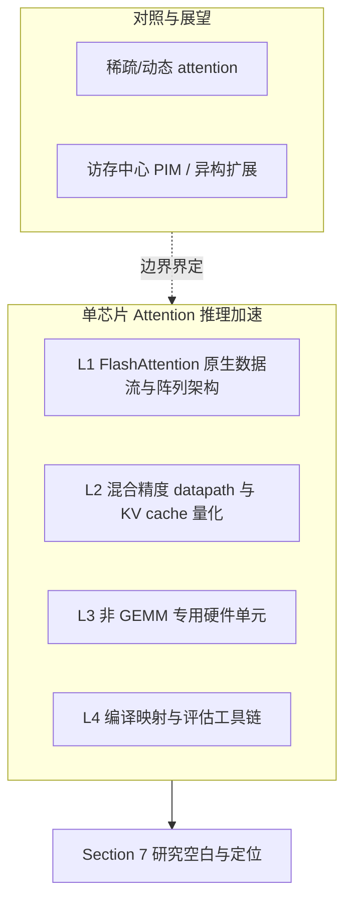

# 综述内容整理

> **R0 文献地图（已完成）。** 英文正文与 BibTeX 见 [manuscript/](manuscript/)。  
> 分类法 L1–L4 仍是**文献组织框架**；**博士课题刀锋**以 [`docs/research_plan.md`](../docs/research_plan.md) 为准（decode × 低比特/混合精度 KV 流式通路），综述 gaps 段已加 companion-plan 脚注。  
> 近年核实对照：[docs/recent_works_comparison.md](../docs/recent_works_comparison.md)、[docs/lit_watch/](../docs/lit_watch/)。

## 基本信息

| 项目 | 内容 |
|------|------|
| **标题** | Energy-Efficient Attention Accelerators for Transformer Inference: A Survey of Software-Hardware Co-Design |
| **格式** | IEEE conference（`IEEEtran`） |
| **正文文件** | [attention_accelerator_survey.tex](manuscript/attention_accelerator_survey.tex) |
| **文献库** | [references.bib](manuscript/references.bib) |
| **状态** | 初稿完成；bib 关键作者已于 2026-07-23 按 ledger 校正；待本机编译 PDF |

## 综述范围

- **纳入**：单芯片/单片加速器上的 Transformer **推理**（prefill + decode），含显式 attention datapath 软硬件协同设计。
- **排除（仅作边界对照）**：分布式训练、多 chiplet 扩展、PIM/CIM 中心架构、稀疏 MoE 调度——见正文 Section 6（Adjacent Directions）。

## 分类法（四条主线）



| 主线 | 核心问题 | 代表工作（cite key） |
|------|----------|----------------------|
| **L1** | 将 online softmax 与分块 $QK^\top$/softmax/$AV$ 映射到 systolic/flattened 阵列 | `dao2022flashattention`, `lin2025systolicattention`, `plena2025`, `flatattention2026`, `wang2023cosa`, `streamattention2025` |
| **L2** | FP8/INT4/MXFP4 KV 存储、旋转抑制 outlier、片上反量化融合 | `liu2024kivi`, `sawint42026`, `bitdecoding2026`, `batquant2026`, `ashkboos2024quarot`, `ultraquant2026` |
| **L3** | softmax/RMSNorm/RoPE 的近似与专用硬件、与主阵列协同 | `mive2026`, `sole2025`, `koca2023exp`, `sun2022softmax` |
| **L4** | 自动 tiling、DMA 重叠、自定义 ISA、Timeloop/SCALE-Sim/TransInferSim 评估 | `parashar2019timeloop`, `scalesimv3_2025`, `klhufek2025transinfersim`, `plena2025` |

## 章节结构

| 节 | LaTeX label | 内容要点 |
|----|-------------|----------|
| **1** Introduction and Background | `sec:intro` | MHA 公式、prefill/decode 瓶颈、FlashAttention 基线、量化基线、范围与分类法、统一对比指标（Table I） |
| **2** FlashAttention-Native Dataflow | `sec:l1` | online softmax 硬件原语、阵列映射分类、prefill vs decode、开放问题 |
| **3** Mixed-Precision Datapath | `sec:l2` | 精度格式与误差预算、量化方法分类、硬件映射模式、精度–效率权衡 |
| **4** Non-GEMM Specialized Units | `sec:l3` | softmax/exp 近似、RMSNorm/rsqrt、RoPE 融合、统一 datapath 对比 |
| **5** Compilation and Co-Design | `sec:l4` | tiling/buffer 调度、自定义 ISA、Timeloop/Accelergy/SCALE-Sim/TransInferSim |
| **6** Adjacent Directions | `sec:adjacent` | Salca/Sanger 等稀疏 attention；AMMA/LoL-PIM 等访存中心方案 |
| **7** Research Gaps and Positioning | `sec:gaps` | 跨主题研究空白、开放问题清单、相对 prior work 的差异化定位（对接 PhD 课题） |
| **8** Conclusion | `sec:conclusion` | 碎片化设计空间、单芯片 integrated co-design 为核心开放问题 |

## 统一对比维度（Table I）

- **性能**：latency、throughput (tokens/s)
- **利用率**：PE utilization（有效 MAC / 峰值 MAC）
- **访存**：SRAM traffic、HBM traffic (bytes)
- **能效与面积**：energy/token、TOPS/W、area (mm²)
- **精度**：task accuracy、PPL、相对 FP32 的 cosine similarity

对比时区分 **prefill** 与 **decode**，能效/吞吐增益在 **iso-accuracy** 前提下解读。

## 核心结论

1. **瓶颈转移**：LLM 推理从算力受限转向 attention 与 KV cache 的 **数据搬运** 受限（尤其长上下文 decode）。
2. **设计模式复现**：IO-aware online softmax、低位宽 KV + 高精度累加、近似 non-GEMM 单元、phase-aware mapper 在 GPU kernel 与 ASIC 中反复出现。
3. **碎片化**：多数工作只优化 1–2 个维度（GPU 数据流 / 单阵列 softmax / KV 量化 / 独立 normalization 加速器），平台与 benchmark 不一致，难以横向比较。
4. **PLENA 例外**：少数端到端覆盖 L1–L4 的单片方案；其余文献多停留在子系统或算法层。
5. **中心开放问题**：在 **同一单片平台** 上联合验证 dataflow、混合精度、non-GEMM 融合与编译调度，并通过算法–架构–RTL 三层评估形成可复现 artifact chain。

## 开放问题清单（Section 7.2）

1. 混合精度下的数值稳定性（KV 量化 + softmax 近似 + RMSNorm 联合界）
2. non-GEMM 误差与低 bit KV 反量化的 **组合敏感性**
3. prefill/decode **双模式** 统一编译调度
4. RoPE 与 projection 的 **硬件融合** 缺乏 Pareto 验证
5. attention-native **代价模型**（online softmax、metadata scale、集合通信）
6. 可复现的 **开源 artifact 链**（算法脚本 + 仿真器 + RTL）

## 生成 PDF

需安装 [MiKTeX](https://miktex.org/download) 或 TeX Live：

```powershell
cd survey\manuscript
pdflatex attention_accelerator_survey
bibtex attention_accelerator_survey
pdflatex attention_accelerator_survey
pdflatex attention_accelerator_survey
```

## 目录结构

```
survey/
├── README.md                          # 本目录说明
├── survey_overview.md                 # 综述内容索引
├── manuscript/
│   ├── attention_accelerator_survey.tex
│   ├── references.bib
│   ├── IEEEtran.cls                   # 本地副本
│   └── README.md
└── papers/                            # 按主线归档的 PDF

templates/latex/ieee/                  # 全项目 LaTeX 模板（权威）
├── IEEEtran.cls
├── IEEEtran_HOWTO.pdf
├── conference_101719.pdf
└── fig1.png
```

## 后续待办（非阻塞）

- [ ] 填写作者与机构信息（`\author` 块）
- [ ] 通读引用与 Table 数值一致性（对照 `docs/lit_watch/ledger.yaml`）
- [ ] 本机编译 PDF 并检查排版
- [ ] 量化倍数目标在 R1 baseline 锁定后再写入（勿在综述中承诺未校准倍数）
